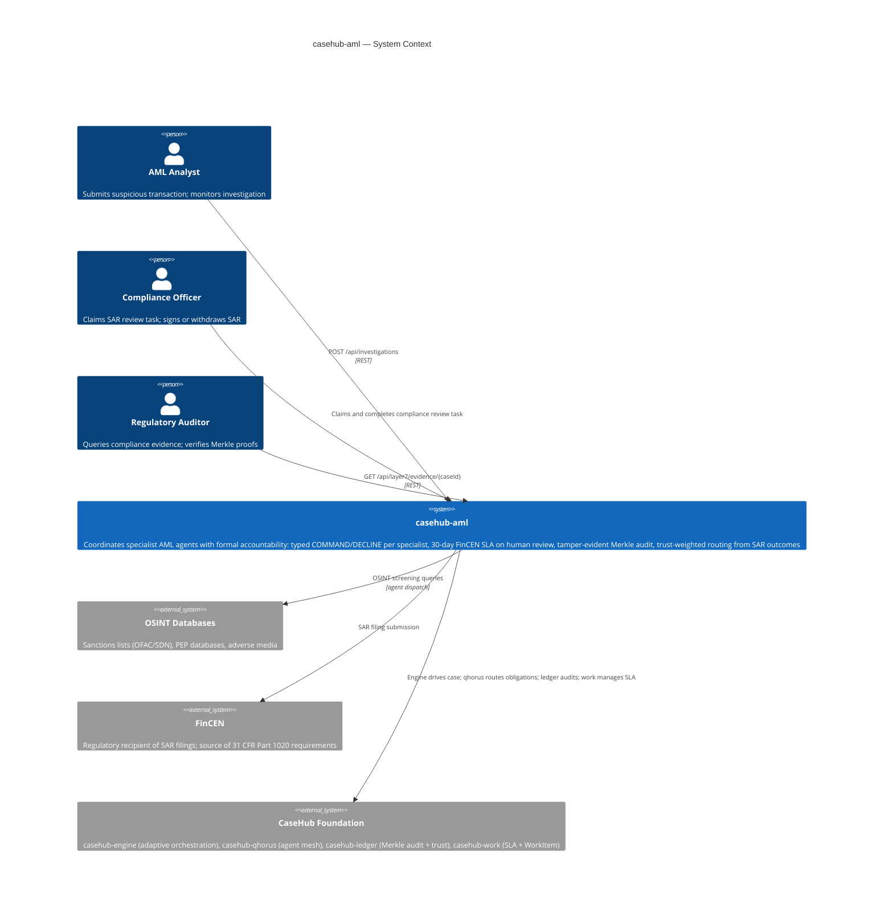
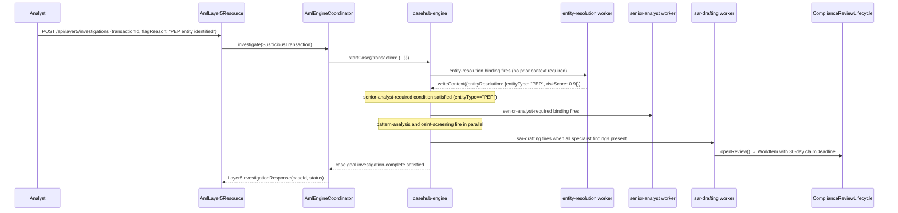
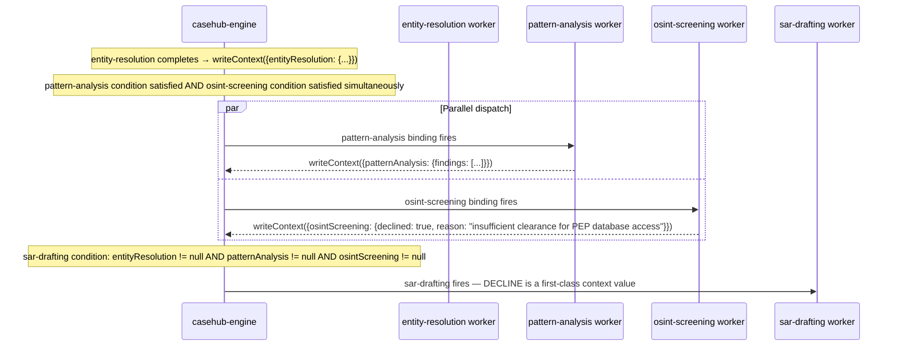
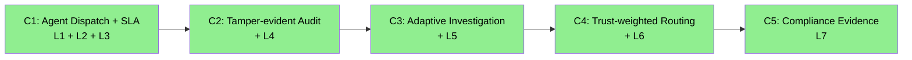

# casehub-aml — ARC42STORIES.MD

**Spec:** Arc42Stories v0.1
**Profile:** CaseHub — Application tier
**Profile ref:** `../parent/docs/arc42stories-casehub-profile.md` · fallback: `https://raw.githubusercontent.com/casehubio/parent/main/docs/arc42stories-casehub-profile.md`
**Prefix:** AML

---

## §1 Introduction and Goals

### Description

`casehub-aml` is an **agentic harness for Anti-Money Laundering investigation** built on the CaseHub platform foundation. It coordinates specialist AI agents (entity resolution, pattern analysis, OSINT screening, SAR drafting), a compliance officer human review gate with 30-day FinCEN SLA, and trust-weighted routing from SAR outcome attestations — producing a tamper-evident investigation record that a FinCEN examiner can verify independently.

The foundation has no domain knowledge. It knows about cases, bindings, workers, commitments, trust, and audit. casehub-aml provides the financial crime domain logic on top: what a suspicious transaction is, how an AML investigation proceeds, which specialists handle what, and how a SAR reaches a compliance officer with a formal deadline.

**Primary audience:** Java developers at financial institutions — a reference architecture showing what structured accountability makes possible in a domain where attribution, deadline, and auditability are regulatory requirements, not optional features.

### Stakeholders

| Stakeholder | Interest |
|---|---|
| Compliance Officer | Claims review task; signs SAR within 30-day FinCEN SLA |
| AML Analyst | Triggers investigation; monitors specialist findings |
| Regulatory Auditor (FinCEN) | Verifies investigation chain is tamper-evident and SLA-compliant |
| Regulatory Auditor (FATF) | Verifies trust-weighted routing and GDPR erasure capability |
| AI Specialist Agents | Execute entity resolution, pattern analysis, OSINT screening, SAR drafting |
| CaseHub Platform Team | Validates foundation correctness via a compliance-critical domain |

### Quality Goals

| Priority | Goal | Scenario |
|---|---|---|
| 1 | Tamper-evident SAR audit | Every agent finding traceable to the commitment that produced it via `causedByEntryId` chain; Merkle proofs independently verifiable |
| 2 | 30-day FinCEN SLA | Compliance officer WorkItem with `claimDeadline`; missed deadline auto-escalates to head of compliance |
| 3 | Formal DECLINE | OSINT agent outside clearance level produces structural DECLINE, not a timeout or error; investigation continues |
| 4 | Trust-weighted routing | SAR outcome attestations feed trust model; experienced analysts route to complex PEP cases automatically |
| 5 | GDPR Art.17 erasure | `LedgerErasureService` + `POST /api/layer7/actors/{actorId}/erasure` endpoint |

### Artifact Schema

Inherits defaults from the [CaseHub Profile](../parent/docs/arc42stories-casehub-profile.md). **Prefix: `AML`** — improvement log entries use `AML-NNN` in `docs/PROGRESS.md`.

---

## §2 Constraints

### Platform

| Constraint | Value |
|---|---|
| Java version | Java 21 (on Java 26 JVM) |
| Framework | Quarkus 3.32.2 — ecosystem-wide lock; bump all projects together |
| Native target | GraalVM 25 |
| Build tool | `mvn` (not `./mvnw` — wrapper not configured) |

```bash
JAVA_HOME=$(/usr/libexec/java_home -v 26) mvn clean install
```

### Architectural

- **Two-tier module structure:** `aml-api/` (pure Java, zero Quarkus, zero JPA) + `aml-app/` (CDI wiring, all Quarkus runtime). Protocol: `module-tier-structure.md`.
- **Layering rule:** Financial crime vocabulary and AML investigation routing belong here. Case lifecycle, commitments, trust, and audit belong in the foundation.
- **Production-first constraint:** Before writing any class: "Would this class exist in a production AML system built to this layer?" If no — do not build it. See `../parent/docs/AGENTIC-HARNESS-GUIDE.md §Anti-patterns`.

### Dependencies

All `casehubio/*` artifacts at `0.2-SNAPSHOT` from GitHub Packages. Parent BOM owns version alignment. casehub-aml may not commit to peer repo directories.

---

## §3 Context and Scope



### Boundary Rules

**casehub-aml owns:** AML domain vocabulary and routing policies; specialist capability definitions; trust thresholds for financial crime; the AML investigation CasePlanModel; SAR narrative assembly; FinCEN/FATF accountability property mapping.

**Foundation owns:** case lifecycle (engine); agent communication mesh and obligation tracking (qhorus); Merkle audit chain and trust scoring (ledger); human task lifecycle and SLA (work).

See `../parent/docs/PLATFORM.md` Capability Ownership table for the full boundary map.
See `../parent/docs/repos/casehub-aml.md` for the AML domain ownership record.

---

## §4 Solution Strategy

### Core Architectural Patterns

| Tier | Pattern blend | AML expression |
|---|---|---|
| Domain | **Clean + Hexagonal** | `aml-api/` is pure Java; ports in `aml-app/`; adapters in `aml-app/` |
| Orchestration | **DDD + Event-Driven + CQRS-lite** | `AmlEngineCoordinator` starts a CaseInstance; engine fires binding events; WAITING state for parallel specialists |
| Application | **Hexagonal + Vertical Slices** | Each vertical slice (S1–S5) is a user-visible accountability property cutting through required layers |
| Cross-cutting | **Strategy + Registry + Observer** | `TrustRoutingPolicyProvider`, `AgentBehaviour` registry, `@ObservesAsync` for trust attestation |

### Layer Taxonomy

CaseHub harness applications follow the Profile integration sequence:

| Layer | Foundation module | Reading order | Status |
|---|---|---|---|
| Domain Baseline | *(none — pure Java)* | L1 | ✅ complete |
| casehub-work | `casehub-work` | L2 | ✅ complete |
| casehub-qhorus | `casehub-qhorus` | L3 | ✅ complete |
| casehub-ledger | `casehub-ledger` | L4 | ✅ complete |
| casehub-engine | `casehub-engine` | L5 | ✅ complete |
| Trust Routing | `casehub-ledger` (trust APIs) | L6 | ✅ complete |
| Compliance Evidence | *(application layer — no new foundation)* | L7 | ✅ complete |
| ActionRiskClassifier | `casehub-engine-work-adapter` | L9 | ✅ complete |

**Note on Layer 7:** Compliance Evidence is an AML-specific application layer, not a standard foundation integration step. It assembles accountability properties from Layers 1–6 into independently verifiable evidence.

### `@DefaultBean` CDI Displacement — the Teaching Pattern

Progressive layer integration is mechanised through CDI displacement:

```java
// Layer 1: always present, never deleted
@ApplicationScoped
@DefaultBean
public class DefaultAmlInvestigationService implements AmlInvestigator { ... }

// Layer 3: displaces above — no explicit CDI configuration required
@ApplicationScoped  // no @DefaultBean
public class QhorusAmlInvestigator implements AmlInvestigator { ... }

// Layer 5: displaces all of the above via engine coordinator
//   AmlInvestigationCoordinator composes AmlInvestigator (CDI-swappable)
//   and ComplianceReviewLifecycle (stable WorkItem concern)
```

Each layer adds an `@ApplicationScoped` implementation. Both classes coexist in the build; no code is deleted. Remove higher-layer JARs and the previous layer's service takes over.

### Chapter Sequencing Rationale (summary — full rationale in §9.2)

- **C1 before C2:** qhorus COMMAND/DONE/DECLINE chain must exist before ledger entries are meaningful
- **C2 before C3:** ledger records the qhorus message chain; casehub-engine starts cases with the engine-generated UUID that flows to both ledger and qhorus as `subjectId`
- **C3 before C4:** trust routing reads `WorkerDecisionEntry` records written by the engine; hard runtime dependency
- **C4 before C5:** compliance evidence assembles properties from all prior layers; cannot exist without them

---

## §5 Building Block View

### Layer Architecture View

```mermaid
C4Container
  title casehub-aml — Layer Architecture (all 7 layers, current delivery state)

  Person(analyst, "AML Analyst", "Submits investigation")
  Person(officer, "Compliance Officer", "Claims SLA-bounded review task")
  Person(auditor, "Regulatory Auditor", "Queries evidence endpoint")

  Container_Boundary(b1, "Layer: Domain Baseline (L1)") {
    Container(domain, "Domain Records", "Pure Java (api/)", "SuspiciousTransaction · InvestigationSummary · AmlInvestigationResult · EntityResolutionResult · PatternAnalysisResult · OsintResult")
    Container(interfaces, "Specialist Service Interfaces", "Pure Java (api/)", "EntityResolutionService · PatternAnalysisService · OsintScreeningService · SarDraftingService")
    Container(port, "AmlInvestigationApplicationService", "Java port (app/)", "CDI displacement boundary — implemented by L1 baseline, displaced by L3+")
    Container(baseline, "DefaultAmlInvestigationService @DefaultBean", "Quarkus CDI (app/)", "Naive baseline — direct stub calls; no SLA, no attribution, no audit")
    Container(rest, "AmlInvestigationResource", "JAX-RS (app/)", "POST /api/investigations — thin dispatcher")
  }

  Container_Boundary(b2, "Layer: casehub-work (L2)") {
    Container(workitem, "WorkItem + 30-day claimDeadline", "casehub-work", "Compliance officer task with FinCEN SLA; candidateGroups=compliance-officers")
    Container(lifecycle, "ComplianceReviewLifecycle", "Quarkus CDI (app/)", "WorkItem creation — stable across Layers 3–7")
  }

  Container_Boundary(b3, "Layer: casehub-qhorus (L3)") {
    Container(qhorus, "QhorusAmlInvestigator", "Quarkus CDI (app/)", "Typed COMMAND/DONE/DECLINE per specialist; SpecialistOutcome<T> sealed interface")
    Container(behaviours, "AgentBehaviour stubs", "Quarkus CDI (app/agents/)", "EntityResolution · PatternAnalysis · OsintScreening (always DECLINE)")
    Container(coordinator, "AmlInvestigationCoordinator", "Quarkus CDI (app/)", "Outer coordinator composing AmlInvestigator + ComplianceReviewLifecycle")
  }

  Container_Boundary(b4, "Layer: casehub-ledger (L4)") {
    Container(ledger, "AmlInvestigationLedgerEntry", "JPA JOINED (app/ledger/)", "CASE_OPENED + COMPLIANCE_REVIEW_OPENED events; causedByEntryId chain")
    Container(ledgersvc, "AmlLedgerService", "Quarkus CDI (app/ledger/)", "Writes domain ledger entries; self-derives causedByEntryId")
  }

  Container_Boundary(b5, "Layer: casehub-engine (L5)") {
    Container(yaml, "aml-investigation.yaml CasePlanModel", "YAML (app/resources/aml/)", "6 capabilities · 7 contextChange bindings · 1 goal")
    Container(casehub, "AmlInvestigationCaseHub", "YamlCaseHub (app/engine/)", "Thin CDI wrapper; delegates 8 worker lambdas to AmlInvestigationCaseDescriptor via @PostConstruct")
    Container(engcoord, "AmlEngineCoordinator", "Quarkus CDI (app/engine/)", "Starts engine case; writes CASE_OPENED ledger entry with engine-returned UUID")
  }

  Container_Boundary(b6, "Layer: Trust Routing (L6)") {
    Container(policy, "AmlTrustRoutingPolicyProvider", "TrustRoutingPolicyProvider SPI (app/routing/)", "Per-capability thresholds; falls back to hardcoded map when PreferenceProvider returns null")
    Container(seeder, "AmlTrustScoreSeeder", "Quarkus CDI (app/trust/)", "Seeds 8 workers with Beta(α,β) at @Priority(20) StartupEvent")
    Container(feedback, "SarOutcomeFeedbackService", "Quarkus CDI (app/trust/)", "SAR verdict → LedgerAttestation → TrustScoreJob recomputes investigation-accuracy")
    Container(attestation, "AmlTrustRoutingAttestation", "JPA JOINED (app/trust/)", "Captures trustScoreAtRouting immutably on WorkerDecisionEvent")
    Container(observer, "AmlTrustRoutingObserver", "Quarkus CDI (app/trust/)", "@ObservesAsync WorkerDecisionEvent — writes attestation before cache drifts")
  }

  Container_Boundary(b7, "Layer: Compliance Evidence (L7)") {
    Container(evidence, "AmlComplianceEvidenceService", "Quarkus CDI (app/compliance/)", "Assembles four requirement-scoped records: AuditChain · SLA · TrustRouting · GdprErasure")
    Container(layer7rest, "AmlLayer7Resource", "JAX-RS (app/compliance/)", "GET /api/layer7/evidence/{caseId} · POST /api/layer7/actors/{actorId}/erasure")
    Container(apitypes, "Compliance API Types", "Pure Java (api/compliance/)", "ComplianceEvidence · RequirementStatus · AuditChainRequirement · SlaRequirement · TrustRoutingRequirement · GdprErasureRequirement · 4 supporting records")
  }

  Rel(analyst, rest, "POST /api/investigations", "HTTP")
  Rel(auditor, layer7rest, "GET /evidence/{caseId}", "HTTP")
  Rel(officer, lifecycle, "Claims and completes WorkItem")
  Rel(rest, port, "dispatches to")
  Rel(coordinator, lifecycle, "composes")
  Rel(engcoord, yaml, "opens case using")
  Rel(casehub, yaml, "parses at startup")
  Rel(observer, attestation, "persists on WorkerDecisionEvent")
  Rel(evidence, ledger, "queries for Merkle proofs")
```



### Two-Tier Module Structure

```
aml-api/    — pure Java; zero Quarkus, zero JPA
  domain/   SuspiciousTransaction · InvestigationSummary · AmlInvestigationResult
            EntityResolutionResult · PatternAnalysisResult · OsintResult
            SpecialistOutcome<T> sealed interface (Completed / Declined / Failed)
            SarOutcome · SarVerdict
  investigation/  EntityResolutionService · PatternAnalysisService
                  OsintScreeningService · SarDraftingService
  compliance/  10 compliance evidence API types (Layer 7)

aml-app/    — CDI wiring; all Quarkus/JPA runtime
  (root)    AmlInvestigationApplicationService · AmlInvestigator (inner interface)
            AmlInvestigationCoordinator · AmlInvestigationResource
            ComplianceReviewLifecycle · AmlJacksonConfig
            Default*Service stubs (5 — one per specialist)
            DefaultAmlInvestigationService @DefaultBean · QhorusAmlInvestigator
  agents/   AgentBehaviour · AgentDispatchMechanism · PushAgentDispatch
            EntityResolutionBehaviour · PatternAnalysisBehaviour · OsintScreeningBehaviour
  compliance/ AmlComplianceEvidenceService · AmlInvestigationOutcomeService
            AmlWorkItemLifecycleObserver · AmlLayer7Resource
  engine/   AmlInvestigationCaseHub · AmlEngineCoordinator
            AmlLayer5Resource · AmlLayer6Resource · Layer5InvestigationResponse
            Layer6InvestigationResponse · WorkerRoutingDecision · SarOutcomeRequest
  ledger/   AmlInvestigationLedgerEntry · AmlLedgerService
  routing/  AmlTrustRoutingPolicyProvider · TrustRoutingPolicyKeys
  trust/    AmlTrustScoreSeeder · AmlTrustRoutingObserver · AmlTrustRoutingAttestation
            AmlTrustAttestationRepository · AmlWorkerDecisionRepository
            SarOutcomeFeedbackService
  rest/     IllegalArgumentExceptionMapper · JsonMappingExceptionMapper · ErrorResponse
```

---

## §6 Runtime View

### Scenario 1 — Content-Driven PEP Routing

When entity resolution identifies a politically exposed person, `senior-analyst-required` fires automatically. No conditional code in the coordinator.



### Scenario 2 — Parallel OSINT + Pattern Analysis

`pattern-analysis` and `osint-screening` share identical preconditions; the engine fires both simultaneously. Total time is `max(pattern, OSINT)` not their sum. OSINT DECLINE writes `{declined: true}` to context, satisfying its condition; `sar-drafting` proceeds without modification.



---

## §7 Deployment View

```
Developer machine / CI:
  JAVA_HOME=$(/usr/libexec/java_home -v 26) mvn clean install
  → aml-api.jar + aml-app-runner.jar

Production target:
  GraalVM 25 native image (aml-app)
  Datasource default: PostgreSQL — casehub-work migrations (V1–V999 AML domain)
  Datasource qhorus:  PostgreSQL — qhorus + ledger + AML ledger subclass migrations
    V1000–V1999  casehub-ledger base tables
    V2000        qhorus message_ledger_entry join (qhorus ships this)
    V2001        aml_investigation_ledger_entry (AML domain, db/aml-ledger/migration/)
    V2002        case_ledger_entry (local re-numbered copy of engine-ledger V2000)
    V2003        worker_decision_entry (local re-numbered copy of engine-ledger V2001)
    V2004        aml_trust_routing_attestation (db/aml-trust-routing/migration/)

Test datasource: H2 MODE=PostgreSQL (both datasources)
  Flyway locations pinned explicitly in both application.properties files

GitHub Packages:
  All casehubio/* artifacts at 0.2-SNAPSHOT
  Resolved via: <url>https://maven.pkg.github.com/casehubio/*</url>
  CI authentication: server-id: github + GITHUB_TOKEN
```

**Flyway locations (test + main — both pinned explicitly):**
- Default datasource: `classpath:db/migration` (casehub-work migrations only)
- Qhorus datasource: `classpath:db/qhorus/migration,classpath:db/ledger/migration,classpath:db/aml-ledger/migration,classpath:db/aml-engine-ledger/migration,classpath:db/aml-trust-routing/migration`

Pinning is mandatory — default classpath scan picks up any future dependency jar adding `db/migration/`, causing silent V-number conflicts. Protocol: `flyway-migration-rules.md`.

---

## §8 Crosscutting Concepts

### Protocol References

| Concern | Protocol / Reference |
|---|---|
| Module tier structure (api/ + app/) | `docs/protocols/universal/module-tier-structure.md` |
| Flyway migration naming and H2 compatibility | `docs/protocols/universal/flyway-migration-rules.md` |
| Flyway version range allocation | `docs/protocols/casehub/flyway-version-range-allocation.md` |
| CDI displacement (`@DefaultBean`) | `docs/protocols/casehub/alternative-extension-patterns.md` |
| SPI placement (which module owns the port) | `../parent/docs/PLATFORM.md §Step 4` |
| Named datasources | `../parent/docs/PLATFORM.md §Persistence` |
| Architectural patterns | `../parent/docs/ARCHITECTURE.md` |
| SPI testing without Mockito | `docs/protocols/universal/spi-testing-alternative-inner-classes.md` |
| `@QuarkusTest` database setup | `docs/protocols/universal/quarkus-test-database.md` |
| Case definition layers (YAML → schema → API) | `casehub/garden: docs/protocols/casehub/case-definition-layers.md` |
| Production-first anti-patterns | `../parent/docs/AGENTIC-HARNESS-GUIDE.md §Anti-patterns` |

### Anti-patterns

The four failure modes most likely when extending casehub-aml.

- **`@Transactional` on the investigation coordinator**
  - **Symptom:** `Unable to acquire JDBC Connection [Exception in association of connection to existing transaction]` — reads like pool exhaustion, but pool metrics are healthy
  - **Cause:** `AmlInvestigationCoordinator.investigate()` delegates to services on two Hibernate persistence units (`default` for `WorkItemService`, `qhorus` for `AmlLedgerService` and `MessageService`). A single `@Transactional` asks JTA to enlist both in one transaction. H2 in the dual-datasource test configuration does not provide XA-capable connections; the association fails. The error message has no mention of XA or multiple datasources.
  - **Fix:** Remove `@Transactional` from the coordinator. Each service already owns its transaction boundary (`WorkItemService @Transactional`, `LedgerWriteService @Transactional`). If true cross-datasource atomicity is required, use a saga or outbox pattern — not a coordinator annotation. (GE referenced in blog `2026-05-25-mdp02-misleading-jdbc-error.md`)

- **Injecting a concrete implementation type instead of the port interface**
  - **Symptom:** `AmbiguousResolutionException` when two `@ApplicationScoped` implementations of `AmlInvestigator` exist, or CDI displacement silently fails — a higher-layer bean is injected alongside the baseline
  - **Cause:** Injecting `DefaultAmlInvestigationService` by concrete type rather than `AmlInvestigator` prevents CDI `@DefaultBean` displacement. The injecting class holds a hard reference to the concrete type; no `@ApplicationScoped` bean can substitute.
  - **Fix:** Always inject the port interface (`AmlInvestigator`, `AmlInvestigationApplicationService`). The `@DefaultBean` displacement pattern works only at the interface level. Verify: at any given layer, exactly one non-`@DefaultBean` implementation of each port interface should be resolvable.

- **`@TestTransaction` on ledger chain tests**
  - **Symptom:** `ledgerService.writeCaseOpened()` returns a non-null entry ID, but the subsequent `findEntryById()` query returns empty — the entry appears to be written but cannot be found
  - **Cause:** `@TestTransaction` wraps the test in a rolled-back outer transaction. `@Transactional(REQUIRED)` in `LedgerWriteService` joins the outer transaction. The write never commits to the H2 in-memory store; the query cannot see it.
  - **Fix:** Remove `@TestTransaction` from ledger integration tests. Use unique identifiers (random UUID per test) for isolation instead of transaction rollback.

- **Sealed interface completeness is a compiler guarantee, not a test guarantee**
  - **Symptom:** `SpecialistOutcome<T>` switch expressions compile and all switch arms are present, but the test suite only covers `Completed` outcomes — `Declined` and `Failed` paths are untested
  - **Cause:** Java enforces exhaustiveness at compile time. Tests enforce correctness at run time. These are orthogonal. A `Failed` arm that always returns an empty string will compile and pass — unless a test specifically exercises it.
  - **Fix:** For every switch on `SpecialistOutcome<T>`, write one test per permit type per specialist. Nine arms = nine tests minimum. (Blog: `2026-05-22-mdp01-sealed-doesnt-mean-tested.md`)

### Security

REST layer: `@RolesAllowed` can be added to resource methods without structural change — auth-retrofit ready by design.

### Observability

`AmlInvestigationLedgerEntry` records every investigation opening. `WorkerDecisionEntry` (engine-ledger) records every specialist dispatch. `AmlTrustRoutingAttestation` captures trust score at routing time. All are append-only. Merkle chain on the qhorus datasource provides tamper-evidence. Audit trail is the primary correctness mechanism; Micrometer metrics for performance.

### Error Handling

DECLINE is a first-class outcome on the case context, not an error. `osint-screening` produces `SpecialistOutcome.Declined` when outside clearance; `sar-drafting` pattern-matches all three variants. Two JAX-RS exception mappers work in tandem: `IllegalArgumentExceptionMapper` for direct service-layer throws; `JsonMappingExceptionMapper` for Jackson-wrapped `ValueInstantiationException` (compact constructor validation — Jackson wraps the cause as `JsonMappingException`, invisible to a single `ExceptionMapper<IllegalArgumentException>`). (GE-20260530-3562b0)

---

## §9 Journeys and Chapters

### §9.1 Journey Overview

| Journey | Description | Chapters | Status |
|---|---|---|---|
| AML Investigation Accountability | A suspicious transaction is flagged, assigned to specialist agents with formal obligations, reviewed by a compliance officer under 30-day FinCEN SLA, producing a tamper-evident SAR audit trail traceable to each agent decision | 5 | ✅ complete (all 5 chapters) |

### §9.2 Chapter Index



| # | Chapter | Journey | Layers touched | Delta | Status |
|---|---|---|---|---|---|
| 1 | Agent Dispatch and SLA | AML Investigation Accountability | L1, L2, L3 | High, Medium, Low | ✅ complete |
| 2 | Tamper-evident Audit | AML Investigation Accountability | + L4 | High | ✅ complete |
| 3 | Adaptive Investigation Paths | AML Investigation Accountability | + L5 | High | ✅ complete |
| 4 | Trust-weighted Routing | AML Investigation Accountability | + L6 | High | ✅ complete |
| 5 | Compliance Evidence | AML Investigation Accountability | L7 | High | ✅ complete |

**Layer × Chapter matrix**

| Layer | C1 ✅ | C2 ✅ | C3 ✅ | C4 ✅ | C5 ✅ |
|---|---|---|---|---|---|
| L1 Domain Baseline | High | Low | — | — | — |
| L2 casehub-work | Medium | Low | Low | — | — |
| L3 casehub-qhorus | Low | — | — | — | — |
| L4 casehub-ledger | — | High | Low | Low | — |
| L5 casehub-engine | — | — | High | Low | — |
| L6 Trust Routing | — | — | — | High | — |
| L7 Compliance Evidence | — | — | — | — | High |

L4 participates in every chapter from C2 onward — `causedByEntryId`, Merkle chain, and trust attestations are all ledger concerns that each subsequent layer extends or reads. L7 has a single column — it is purely additive, assembling what the prior six layers produce.

**Sequencing rationale:**
- C1 before C2: qhorus COMMAND/DONE/DECLINE (L3) generates the `MessageLedgerEntry` records that make the L4 tamper-evident audit meaningful; without the message chain the ledger is sparse
- C2 before C3: engine (L5) assigns a UUID per case; that UUID flows to `AmlLedgerService` as `subjectId` — ledger entries must exist before the engine-returned ID can anchor them
- C3 before C4: trust routing (L6) reads `WorkerDecisionEntry` records written by the engine at C3 — hard runtime dependency
- C4 before C5: compliance evidence (L7) assembles properties from Layers 1–6; cannot verify SLA, Merkle chain, or routing attestations without them

---

### §9.3 Chapter Entries

---

#### Chapter 1 — Agent Dispatch and SLA

**Journey:** AML Investigation Accountability | **Sequence:** 1 of 5 | **Status:** ✅ complete
**Delivered:** L1 2026-05-10 · L2 2026-05-13 · L3 2026-05-17 | **Issues:** aml#12, #15, #19 | **Blog:** `blog/2026-05-10-mdp01-aml-first-code-layer-1.md`; `blog/2026-05-13-mdp01-layer2-compliance-workitem.md`; `blog/2026-05-18-mdp01-layer3-five-surprises.md`

**What this delivers**
A suspicious transaction triggers typed COMMAND dispatch to three specialist agents (entity resolution, pattern analysis, OSINT screening); each responds with a formal DONE or DECLINE; the compliance officer receives a WorkItem with a 30-day FinCEN `claimDeadline`. The investigation is accountable: every specialist response is a persisted commitment, and the human review gate has a formal deadline.

**Accountability gaps closed**
- No attribution (which agent made this recommendation?) → L3 qhorus COMMAND/DONE/DECLINE persisted as `MessageLedgerEntry`
- No response SLA → L2 WorkItem with 30-day `claimDeadline`; `candidateGroups=compliance-officers`
- No formal DECLINE → L3 `OsintScreeningBehaviour` DECLINEs for PEP database access; investigation completes regardless

**Layer Impact**
| Layer | Delta |
|---|---|
| L1 Domain Baseline | High — domain records, specialist interfaces, `@DefaultBean` baseline, REST entry point |
| L2 casehub-work | Medium — WorkItem SLA, `ComplianceReviewLifecycle`, `complianceReviewTaskId` on result |
| L3 casehub-qhorus | Low — typed COMMAND/DONE/DECLINE, `SpecialistOutcome<T>` sealed interface, coordinator pattern |

---

#### Chapter 2 — Tamper-evident Audit

**Journey:** AML Investigation Accountability | **Sequence:** 2 of 5 | **Status:** ✅ complete
**Delivered:** 2026-05-23 | **Issues:** aml#30 | **Blog:** `blog/2026-05-21-mdp01-what-flyway-was-hiding.md`; `blog/2026-05-23-mdp01-channel-ids-terrible-audit-keys.md`

**What this delivers**
Every investigation creates an `AmlInvestigationLedgerEntry` chain: `CASE_OPENED` linked to `COMPLIANCE_REVIEW_OPENED` via `causedByEntryId`. All qhorus specialist messages carry `subjectId = caseId`, grouping the commitment chain under the same queryable audit key. A FinCEN examiner querying by `caseId` retrieves the full investigation record — not a sparse set indexed by infrastructure labels.

**Accountability gaps closed**
- No tamper-evident record → Merkle chain on qhorus datasource; Merkle inclusion proofs per entry
- No causal chain → `COMPLIANCE_REVIEW_OPENED.causedByEntryId` links to the `CASE_OPENED` that produced it
- qhorus messages indexed by channel ID not domain aggregate → `MessageDispatch.subjectId = caseId` (qhorus#184 shipped)

**Layer Impact**
| Layer | Delta |
|---|---|
| L4 casehub-ledger | High — `AmlInvestigationLedgerEntry`, `AmlLedgerService`, Flyway V2001, `caseId` as UUID |
| L2 casehub-work | Low — `AmlInvestigationResult` extended with `caseId` and `ledgerCaseEntryId` |
| L1 Domain Baseline | Low — `AmlInvestigator` interface gains `caseId` parameter |

---

#### Chapter 3 — Adaptive Investigation Paths

**Journey:** AML Investigation Accountability | **Sequence:** 3 of 5 | **Status:** ✅ complete
**Delivered:** 2026-05-25 | **Issues:** aml#31 | **Blog:** `blog/2026-05-24-mdp01-layer-5-was-never-blocked.md`; `blog/2026-05-25-mdp01-parallel-by-default.md`

**What this delivers**
The engine's binding evaluation replaces the fixed sequential specialist pipeline. PEP routing fires automatically when entity resolution outputs `entityType == "PEP"` — no conditional code in the coordinator. Pattern analysis and OSINT screening fire in parallel when entity resolution completes. DECLINE writes `{declined: true}` to context, satisfying the condition for `sar-drafting` to proceed.

**Accountability gaps closed**
- Sequential specialist pipeline → engine fires `pattern-analysis` and `osint-screening` simultaneously on identical binding conditions; investigation time no longer doubles on complex cases
- Hardcoded routing → `senior-analyst-required` binding fires on `entityType == "PEP"` or `riskScore > 0.8`; no coordinator code needed

**Layer Impact**
| Layer | Delta |
|---|---|
| L5 casehub-engine | High — `aml-investigation.yaml`, `AmlInvestigationCaseHub`, `AmlEngineCoordinator`, `AmlLayer5Resource` |
| L4 casehub-ledger | Low — engine-generated UUID becomes the shared `caseId` across all ledger entries and qhorus messages |
| L2 casehub-work | Low — `ComplianceReviewLifecycle.openReview()` called by `sar-drafting` worker |

---

#### Chapter 4 — Trust-weighted Routing

**Journey:** AML Investigation Accountability | **Sequence:** 4 of 5 | **Status:** ✅ complete
**Delivered:** 2026-05-29 | **Issues:** aml#38 | **Blog:** `blog/2026-05-29-mdp01-trust-loop-complete.md`

**What this delivers**
Agent selection moves from availability routing to trust-weighted selection: `AmlTrustRoutingPolicyProvider` supplies per-capability thresholds; workers below threshold are excluded; above-threshold workers compete by score. The senior SAR drafter (Beta(9,1) = 90% mean) immediately outscores the junior (Beta(2,8) = 20% mean, below 0.75 threshold). `POST /{caseId}/outcome` closes the feedback loop — a `LedgerAttestation` on the `sar-drafting` `WorkerDecisionEntry` feeds the next `TrustScoreJob` cycle.

**Accountability gaps closed**
- Blind worker selection → `TrustWeightedAgentStrategy` reads `AmlTrustRoutingPolicyProvider`; workers below capability threshold excluded from selection
- No outcome feedback → SAR verdict writes `LedgerAttestation`; `TrustScoreJob` recomputes `investigation-accuracy` from all attestations

**Layer Impact**
| Layer | Delta |
|---|---|
| L6 Trust Routing | High — `AmlTrustRoutingPolicyProvider`, `AmlTrustScoreSeeder`, `SarOutcomeFeedbackService`, `AmlTrustRoutingAttestation`, `AmlTrustRoutingObserver`, `AmlLayer6Resource`, Flyway V2002–V2004 |
| L5 casehub-engine | Low — `AmlEngineCoordinator` reused; routing strategy activates automatically from engine-ledger dependency |
| L4 casehub-ledger | Low — `AmlWorkerDecisionRepository` queries `WorkerDecisionEntry` on qhorus PU |

---

#### Chapter 5 — Compliance Evidence

**Journey:** AML Investigation Accountability | **Sequence:** 5 of 5 | **Status:** ✅ complete
**Delivered:** 2026-05-30 | **Issues:** aml#43 | **Blog:** `blog/2026-05-31-mdp01-proof-not-claims.md`

**What this delivers**
`GET /api/layer7/evidence/{caseId}` returns four requirement-scoped records — audit chain, SLA, trust routing, GDPR erasure — each with a computed `RequirementStatus` (`CLOSED`, `PARTIAL`, `BREACHED`, or `GAP`) and the underlying cryptographic proofs or structural data an examiner needs to verify independently. The service does not self-attest; it surfaces the evidence so the examiner can verify.

**Accountability gaps closed**
- No externally verifiable evidence → Merkle inclusion proofs per ledger event; examiner reconstructs tree root independently
- Broken causal chain (prerequisite) → `writeComplianceReviewOpened()` self-derives `causedByEntryId`; works for both synchronous and async engine paths
- Trust score drift → `AmlTrustRoutingAttestation` captures `trustScoreAtRouting` immutably at `WorkerDecisionEvent` fire time

**Layer Impact**
| Layer | Delta |
|---|---|
| L7 Compliance Evidence | High — 10 API types in `api/compliance/`, `AmlComplianceEvidenceService`, `AmlLayer7Resource`, `AmlTrustRoutingAttestation`, `AmlTrustRoutingObserver`, Flyway V2004 |

---

### §9.4 Layer Entries

---

### Layer — Domain Baseline

**Participates in chapters:** C1, C2, C3, C4, C5
**Architectural patterns:** Clean (dependency rule — pure Java domain, zero framework imports); Hexagonal (`AmlInvestigationApplicationService` port; adapters in `aml-app/`)
**Key protocols:** `module-tier-structure.md` (two-tier: api/ + app/); `alternative-extension-patterns.md` (@DefaultBean displacement)
**Design refs:** none — baseline by definition
**Issues:** casehubio/aml#12
**Navigation:** `git log --grep="#12" --oneline`
**Blog:** `blog/2026-05-10-mdp01-aml-first-code-layer-1.md`
**Improvement refs:** 🔲
**Completed:** 2026-05-10

#### What it adds

**Before:** No implementation. No domain vocabulary. No service interfaces. No REST entry point.
**After:** `DefaultAmlInvestigationService @DefaultBean` — naive baseline implementation of `AmlInvestigationApplicationService`; makes direct stub calls with no accountability.

What this layer adds:
- **AML domain vocabulary** — immutable records in `api/domain/`: `SuspiciousTransaction`, `InvestigationSummary`, `AmlInvestigationResult`, `EntityResolutionResult`, `PatternAnalysisResult`, `OsintResult`; no framework dependencies
- **Specialist service interfaces** — `EntityResolutionService`, `PatternAnalysisService`, `OsintScreeningService`, `SarDraftingService` in `api/investigation/`; one interface per agent concern
- **`@DefaultBean` displacement anchor** — `DefaultAmlInvestigationService` carries `@DefaultBean` so each subsequent layer adds an `@ApplicationScoped` implementation that takes CDI priority without touching the baseline
- **REST entry point** — `AmlInvestigationResource` exposes `POST /api/investigations`; thin dispatcher only

Not closed here: L1 establishes the accountability gaps that subsequent layers close. No SLA (L2). No attribution (L3). No tamper-evident audit (L4). No adaptive routing (L5). No trust weighting (L6).

#### Accountability gaps closed

None closed by L1 — this layer establishes the gaps that subsequent layers close.

| Gap established | What breaks | Closed by |
|---|---|---|
| No attribution | Which agent resolved this entity graph? No record. | L3 (qhorus COMMAND/DONE/DECLINE) |
| No failure resilience | Service timeout loses all partial investigation work | L3 (FAILURE is an explicit outcome type) |
| No deadline tracking | No FinCEN 30-day SLA; no parallel execution | L2 (casehub-work claimDeadline) + L5 (engine parallel binding) |
| No audit trail | SAR narrative cannot be proven to FinCEN | L4 (casehub-ledger Merkle chain) |

#### Key files

- `api/src/main/java/io/casehub/aml/domain/SuspiciousTransaction.java` — flagged transaction; carries `id` (String) and `flagReason`
- `api/src/main/java/io/casehub/aml/domain/InvestigationSummary.java` — three specialist outcomes; becomes `SpecialistOutcome<T>` fields at L3
- `api/src/main/java/io/casehub/aml/domain/AmlInvestigationResult.java` — use-case output; gains `complianceReviewTaskId` at L2, `caseId` and `ledgerCaseEntryId` at L4
- `api/src/main/java/io/casehub/aml/domain/EntityResolutionResult.java` — gains `entityType` and `riskScore` at L5 for PEP routing
- `api/src/main/java/io/casehub/aml/domain/PatternAnalysisResult.java` — pattern findings record
- `api/src/main/java/io/casehub/aml/domain/OsintResult.java` — OSINT screening result
- `api/src/main/java/io/casehub/aml/investigation/EntityResolutionService.java` — specialist interface
- `api/src/main/java/io/casehub/aml/investigation/PatternAnalysisService.java` — specialist interface
- `api/src/main/java/io/casehub/aml/investigation/OsintScreeningService.java` — specialist interface
- `api/src/main/java/io/casehub/aml/investigation/SarDraftingService.java` — accepts `SpecialistOutcome<T>` at L3
- `app/src/main/java/io/casehub/aml/AmlInvestigationApplicationService.java` — use-case port interface; CDI displacement boundary
- `app/src/main/java/io/casehub/aml/DefaultAmlInvestigationService.java` — `@ApplicationScoped @DefaultBean`; direct stub calls; never deleted
- `app/src/main/java/io/casehub/aml/AmlInvestigationResource.java` — `POST /api/investigations`; thin dispatcher
- `app/src/main/java/io/casehub/aml/Default*.java` (5 files) — default specialist implementations; return stub results

#### Key wiring

**`api/` is zero-framework — no JPA, no Quarkus.**
`aml-api` compiles with no `io.quarkus.*` or `jakarta.persistence.*` imports. Any class that adds a framework dependency belongs in `aml-app/`, not `aml-api/`. This enforces the dependency rule: domain logic never depends on infrastructure.

**`@DefaultBean` on the baseline service.**
CDI displacement works at the interface level. `DefaultAmlInvestigationService @DefaultBean` is the fallback; any `@ApplicationScoped` implementation of `AmlInvestigationApplicationService` without `@DefaultBean` takes priority automatically. Both classes coexist in all layers; no code is deleted.

```java
@ApplicationScoped
@DefaultBean  // displaced by any @ApplicationScoped impl without @DefaultBean
public class DefaultAmlInvestigationService implements AmlInvestigationApplicationService { ... }
```

**Port interface in `app/`, not `api/`.**
`AmlInvestigationApplicationService` lives in `aml-app/` because it references the orchestration concern (it takes domain types from `api/` but is not itself a pure domain type). The hexagonal rule: domain types in `api/`; use-case ports in `app/`. Layer N implementations also live in `app/` — no module dependency cycle results.

#### Architectural decisions

**Why stub default implementations rather than null returns:** Each default implementation (`DefaultEntityResolutionService`, etc.) returns a minimal but structured result. Null returns would require null checks throughout `DefaultSarDraftingService.draft()`. The stubs make L1 runnable end-to-end from a single HTTP call and establish the result shapes that L3 extends.

#### Pattern introduced

**`@DefaultBean` CDI displacement** — each layer adds a higher-priority `@ApplicationScoped` implementation in `aml-app/` that displaces the baseline without deleting it. The baseline remains a legitimate fallback in production.

#### Pattern anchor

`app/DefaultAmlInvestigationService.java` (`@DefaultBean` baseline) + `app/AmlInvestigationApplicationService.java` (port that controls the displacement boundary).

#### Gotchas

- **No gotchas for Layer 1** — it has no framework dependencies. Any complexity here is a sign that domain logic leaked into infrastructure.

#### Pattern to replicate

1. Create `{domain}-api` Maven module — zero framework imports, zero JPA, no Quarkus
2. Define domain records in `{domain}-api/src/main/java/{package}/domain/` — immutable, no behaviour
3. Define specialist service interfaces in `{domain}-api/src/main/java/{package}/investigation/` — one interface per agent concern
4. Create `{domain}-app` Maven module — depends on `{domain}-api`; owns all Quarkus/CDI wiring
5. Define the use-case port interface in `{domain}-app/` — takes domain types, returns domain types; do not place it in `{domain}-api/`
6. Implement each specialist stub in `{domain}-app/` — direct return with placeholder values; no CDI on the impl classes except `@ApplicationScoped`
7. Implement the baseline coordinator with `@ApplicationScoped @DefaultBean` — calls specialists via private methods; document accountability gaps as comments
8. Expose `POST /api/{domain-noun}` via a REST resource injecting the port interface
9. Write unit tests for the baseline — plain `new DefaultXxxService()`, no Quarkus; verify non-null output

---

### Layer — casehub-work

**Participates in chapters:** C1, C2, C3, C4, C5
**Architectural patterns:** Hexagonal (`WorkItem` as compliance lifecycle port); Event-Driven (CDI displacement pattern; `WorkItemService` injected as port)
**Key protocols:** `flyway-migration-rules.md`; `module-tier-structure.md`; `flyway-version-range-allocation.md`
**Design refs:** none
**Issues:** casehubio/aml#15
**Navigation:** `git log --grep="#15" --oneline`
**Blog:** `blog/2026-05-13-mdp01-layer2-compliance-workitem.md`; `blog/2026-05-16-mdp01-broken-promise-layer-2.md`
**Improvement refs:** 🔲
**Completed:** 2026-05-13

#### What it adds

**Before:** Investigation completes with no deadline on the compliance review.
**After:** `ComplianceReviewLifecycle` creates a `WorkItem` with a 30-day `claimDeadline`; `AmlInvestigationResult` carries `complianceReviewTaskId`.

What this layer adds:
- **30-day FinCEN SLA** — `WorkItem` with `claimDeadline = now().plusDays(30)`; `candidateGroups = compliance-officers`; `callerRef = "aml:investigation/{caseId}"`
- **WorkItem SLA enforcement** — missed deadline escalates via casehub-work `SlaBreachPolicy`; compliance officer has a formal deadline, not an indefinite inbox item
- **`ComplianceReviewLifecycle`** — stable WorkItem concern extracted from the original Layer 2 coordinator; unchanged as specialist implementations evolve through Layers 3–7

Not closed here: no attribution per specialist decision (L3). No tamper-evident ledger entry linking the review back to the investigation (L4).

#### Accountability gaps closed

| Gap | What breaks without it | Closed by |
|---|---|---|
| No compliance SLA | Review sits indefinitely; officer has no formal deadline | WorkItem with 30-day `claimDeadline`; `candidateGroups=compliance-officers` |
| No escalation path | Missed SLA sits silently — no notification or auto-escalation | casehub-work SLA breach policy (auto-escalation wired in casehub-work) |

#### Key files

- `api/src/main/java/io/casehub/aml/domain/AmlInvestigationResult.java` — extended to carry `complianceReviewTaskId`
- `app/src/main/java/io/casehub/aml/ComplianceReviewLifecycle.java` — WorkItem concern; stable through Layers 3–7; extracted from the original `WorkItemAmlInvestigationService` (deleted at L3 when coordinator pattern replaced direct injection)

*Note: `WorkItemAmlInvestigationService.java` (the original L2 implementation) was deleted at Layer 3 when the coordinator pattern replaced it. `ComplianceReviewLifecycle` is the surviving L2 concern.*

#### Key wiring

**`casehub-work-api` in `api/`, `casehub-work` in `app/`.**
`casehub-work-api` is JPA-free — safe to add to `aml-api/`. The full runtime with JPA entities goes in `aml-app/` only. This preserves the module purity constraint.

**Two Hibernate scan packages required.**
`casehub-work` requires both `io.casehub.work.runtime.model` and `io.casehub.work.runtime.filter` in Hibernate scan packages. Omitting `runtime.filter` causes silent failures where filter beans are not found:
```properties
quarkus.hibernate-orm.packages=io.casehub.work.runtime.model,io.casehub.work.runtime.filter
```

**`WorkItemCreateRequest` fluent builder.**
`WorkItemCreateRequest` uses a fluent builder (casehubio/work#168). Set only the fields AML needs: `title`, `category`, `candidateGroups`, `claimDeadline`, `callerRef`. The positional 19-parameter constructor is gone — the record field count grew past 24. `ComplianceReviewLifecycle` is immune to future field additions.

**CDI displacement — original Layer 2 bug.**
The original `WorkItemAmlInvestigationService` injected `DefaultAmlInvestigationService` by concrete type. CDI `@DefaultBean` displacement works at the interface level — injecting by concrete type prevents any other bean from substituting. Layer 3 fixed this by introducing `AmlInvestigator` as the injection type and extracting `ComplianceReviewLifecycle` as a stable separate concern.

#### Architectural decisions

**Why `ComplianceReviewLifecycle` as a separate bean, not inline in the coordinator:** The WorkItem concern is stable — it does not change as the specialist investigation mechanism evolves from Layer 1 stub to Layer 3 qhorus to Layer 5 engine. Extracting it as a separate CDI bean means `AmlInvestigationCoordinator` and `AmlEngineCoordinator` both compose it without duplication.

#### Pattern introduced

**Stable WorkItem lifecycle component** — `ComplianceReviewLifecycle` is extracted as a separate CDI bean injected by both the direct coordinator (L3) and the engine coordinator (L5). The compliance concern does not change as the specialist concern evolves.

#### Pattern anchor

`app/ComplianceReviewLifecycle.java` — the stable WorkItem concern composed by all higher-layer coordinators.

#### Gotchas

- **Symptom:** Quarkus test startup fails with Flyway error about duplicate migration version V2.
  - **Cause:** `casehub-work` and `casehub-qhorus` both ship a `V2` Flyway migration. When both are on the test classpath, Flyway refuses to start.
  - **Fix:** Disable Flyway in tests; use drop-and-create. Do not restore `migrate-at-start=true` until the upstream conflict is resolved. (GE-20260513-74dc72)
  ```properties
  quarkus.flyway.migrate-at-start=false
  quarkus.flyway.qhorus.migrate-at-start=false
  quarkus.hibernate-orm.database.generation=drop-and-create
  quarkus.hibernate-orm.qhorus.database.generation=drop-and-create
  ```

- **Symptom:** CDI ambiguity error when both `DefaultAmlInvestigationService` and `WorkItemAmlInvestigationService` are present.
  - **Cause:** Both implement `AmlInvestigationApplicationService`. Without `@DefaultBean` on the default, CDI sees two equal candidates.
  - **Fix:** `@DefaultBean` on the baseline service makes it the fallback; any `@ApplicationScoped` without `@DefaultBean` takes priority. The original L2 file (`WorkItemAmlInvestigationService`) was deleted at L3 — this gotcha applies if recreating the direct injection approach.

#### Pattern to replicate

1. Add `casehub-work-api` to `{domain}-api/pom.xml` — JPA-free, safe in the pure domain module
2. Add `casehub-work` to `{domain}-app/pom.xml` — brings JPA entities and `WorkItemService`
3. Configure Hibernate scan packages: `quarkus.hibernate-orm.packages=io.casehub.work.runtime.model,io.casehub.work.runtime.filter`
4. Add Flyway/reactive workarounds to test `application.properties` (see Gotchas)
5. Extract a `{Domain}ComplianceLifecycle` bean — owns WorkItem creation, `claimDeadline`, `candidateGroups`, `callerRef`; inject into coordinator
6. Extend your result type to carry a `taskId` field
7. Write unit test: verify `WorkItemCreateRequest` fields without Quarkus; write `@QuarkusTest`: POST the domain endpoint, assert task ID present, WorkItem exists with correct `claimDeadline` and `candidateGroups`
8. Run: `mvn verify -pl api,app -am -Dsurefire.failIfNoSpecifiedTests=false`

---

### Layer — casehub-qhorus

**Participates in chapters:** C1, C3
**Architectural patterns:** Hexagonal (`AgentBehaviour` SPI; `AgentDispatchMechanism` port); Strategy (`AgentBehaviour` — pluggable per specialist); Event-Driven (qhorus COMMAND/DONE/DECLINE persisted as `MessageLedgerEntry`)
**Key protocols:** `alternative-extension-patterns.md` (CDI displacement for `AmlInvestigator`); `module-tier-structure.md`
**Design refs:** workspace `specs/2026-05-17-layer3-composer-qhorus-design.md`
**Issues:** casehubio/aml#19
**Navigation:** `git log --grep="#19" --oneline`
**Blog:** `blog/2026-05-16-mdp01-broken-promise-layer-2.md`; `blog/2026-05-18-mdp01-layer3-five-surprises.md`
**Improvement refs:** 🔲
**Completed:** 2026-05-17

#### What it adds

**Before:** `DefaultAmlInvestigationService` makes direct stub calls with no formal obligation.
**After:** `QhorusAmlInvestigator @ApplicationScoped` (no `@DefaultBean`) displaces `DefaultAmlInvestigationService`; each specialist dispatch sends a COMMAND and receives a formal DONE or DECLINE persisted to qhorus.

What this layer adds:
- **Typed specialist dispatch** — each agent interaction is a formal COMMAND; response is DONE or DECLINE; both persisted to qhorus `MessageLedgerEntry`
- **`SpecialistOutcome<T>` sealed interface** — `Completed<T>`, `Declined`, `Failed`; replaces concrete result types in `InvestigationSummary` and `SarDraftingService`; allows `sar-drafting` to pattern-match all three variants
- **Composer pattern** — `AmlInvestigationCoordinator` composes `AmlInvestigator` (CDI-swappable inner interface) and `ComplianceReviewLifecycle` (stable WorkItem concern); separation means specialist implementation can evolve without touching compliance lifecycle
- **DECLINE as formal scope boundary** — `OsintScreeningBehaviour` DECLINEs for PEP database access (insufficient clearance); investigation completes regardless; DECLINE writes `{declined: true, ...}` to the specialist outcome

Not closed here: no engine-driven parallel execution (L5). No Merkle audit entries (L4).

#### Accountability gaps closed

| Gap | What breaks without it | Closed by |
|---|---|---|
| No attribution | No record of which agent made a specialist decision or when | COMMAND per specialist; DONE/DECLINE persisted in qhorus `MessageLedgerEntry` |
| No failure resilience | Service timeout loses all partial investigation work with no trace | Each agent interaction is a formal Commitment; FAILURE is an explicit outcome type |

#### Key files

- `api/src/main/java/io/casehub/aml/domain/SpecialistOutcome.java` — sealed interface: `Completed<T>`, `Declined`, `Failed`
- `api/src/main/java/io/casehub/aml/domain/InvestigationSummary.java` — three fields now `SpecialistOutcome<T>`
- `api/src/main/java/io/casehub/aml/investigation/SarDraftingService.java` — all three params now `SpecialistOutcome<T>`
- `app/src/main/java/io/casehub/aml/AmlInvestigator.java` — inner interface (investigation concern; swappable via CDI)
- `app/src/main/java/io/casehub/aml/AmlInvestigationCoordinator.java` — outer coordinator; composes `AmlInvestigator` + `ComplianceReviewLifecycle`
- `app/src/main/java/io/casehub/aml/AmlJacksonConfig.java` — `ObjectMapperCustomizer`; adds `@JsonTypeInfo` + `@JsonSubTypes` mixin for `SpecialistOutcome` without importing Jackson into `api/`
- `app/src/main/java/io/casehub/aml/agents/AgentBehaviour.java` — SPI: one implementation per specialist
- `app/src/main/java/io/casehub/aml/agents/AgentDispatchMechanism.java` — SPI: `PushAgentDispatch` (qhorus) vs `NoOpAgentDispatch` (test)
- `app/src/main/java/io/casehub/aml/agents/OsintScreeningBehaviour.java` — always DECLINEs (clearance gate)
- `app/src/main/java/io/casehub/aml/agents/EntityResolutionBehaviour.java` — stub; returns `Completed` with default service result
- `app/src/main/java/io/casehub/aml/agents/PatternAnalysisBehaviour.java` — stub; returns `Completed`
- `app/src/main/java/io/casehub/aml/agents/PushAgentDispatch.java` — `AgentDispatchMechanism` impl; `@Typed` prevents CDI ambiguity
- `app/src/main/java/io/casehub/aml/QhorusAmlInvestigator.java` — Layer 3 investigator; `@ApplicationScoped` (no `@DefaultBean`); displaces baseline

#### Key wiring

**`SpecialistOutcome<T>` in `api/` — pure Java; Jackson in `app/` only.**
The sealed interface carries no Jackson annotations. `AmlJacksonConfig implements ObjectMapperCustomizer` registers a mixin in `app/` that adds `@JsonTypeInfo(use = Id.NAME, property = "type")` and `@JsonSubTypes` for all three permits. Without this, `summary.osintScreening.type` in the JSON response is absent and REST assertions return null.

```java
@Singleton
public class AmlJacksonConfig implements ObjectMapperCustomizer {
    @JsonTypeInfo(use = Id.NAME, property = "type")
    @JsonSubTypes({
        @JsonSubTypes.Type(value = SpecialistOutcome.Completed.class, name = "Completed"),
        @JsonSubTypes.Type(value = SpecialistOutcome.Declined.class,  name = "Declined"),
        @JsonSubTypes.Type(value = SpecialistOutcome.Failed.class,    name = "Failed")
    })
    interface SpecialistOutcomeMixin {}
    @Override public void customize(ObjectMapper mapper) {
        mapper.addMixIn(SpecialistOutcome.class, SpecialistOutcomeMixin.class);
    }
}
```

**CDI displacement — concrete type injection was the Layer 2 bug.**
`WorkItemAmlInvestigationService` (the original L2 class, deleted at L3) injected `DefaultAmlInvestigationService` by concrete type. `@DefaultBean` displacement works only at the interface level. L3 introduces `AmlInvestigator` as the injection type; `QhorusAmlInvestigator` (no `@DefaultBean`) displaces `DefaultAmlInvestigationService` (`@DefaultBean`) automatically via CDI priority rules.

**Direct dispatch — not `channelGateway.fanOut()`.**
`QhorusAmlInvestigator` calls `AgentBehaviour.handle()` directly after sending the COMMAND message. `channelGateway.fanOut()` does NOT trigger `PushAgentDispatch.post()` as designed — root cause unknown (aml#22). COMMAND and DONE/DECLINE messages ARE persisted to qhorus via `MessageService.dispatch()`. The formal commitment lifecycle exists in the DB; fan-out triggering is a production extension point for real AI agents.

**`@Typed` on `PushAgentDispatch` prevents CDI ambiguity.**
`PushAgentDispatch` implements `AgentChannelBackend`. Without `@Typed`, CDI sees it as a candidate for `AgentChannelBackend` injection alongside `QhorusChannelBackend` (the default backend). Fix: `@Typed({AgentDispatchMechanism.class, PushAgentDispatch.class})`.

**`LedgerVerificationService` excluded in tests.**
Three casehub-ledger services inject `ReactiveLedgerEntryRepository`, which is vetoed in JDBC-only test mode. All three excluded via `quarkus.arc.exclude-types` in test `application.properties`. None are exercised by AML tests.

#### Architectural decisions

**Why `AmlInvestigator` as an inner interface rather than reusing `AmlInvestigationApplicationService`:** The outer port interface takes a `SuspiciousTransaction` and returns `AmlInvestigationResult`. The inner investigator interface takes `SuspiciousTransaction` + `UUID caseId` and returns `InvestigationSummary`. These are different concerns. Reusing the outer port for both would collapse the investigation concern and the compliance lifecycle into a single displacement boundary.

**Why the composer pattern over the direct-injection approach:** Direct injection of `DefaultAmlInvestigationService` by concrete type (the Layer 2 mistake) prevents CDI displacement. The composer pattern gives `AmlInvestigationCoordinator` stable composition semantics — it composes by interface, not by concrete type — enabling each inner component to evolve independently.

#### Pattern introduced

**Composer pattern with inner SPI** — `AmlInvestigationCoordinator` composes `AmlInvestigator` (CDI-swappable inner interface) and `ComplianceReviewLifecycle` (stable outer concern). Each is independently replaceable via CDI without touching the coordinator.

#### Pattern anchor

`app/AmlInvestigationCoordinator.java` (outer coordinator) + `app/QhorusAmlInvestigator.java` (inner investigator displacing the baseline).

#### Gotchas

- **Symptom:** Jackson serializes `SpecialistOutcome<T>` fields without a `"type"` discriminator — REST assertions on `summary.osintScreening.type` return null.
  - **Cause:** Sealed interfaces don't carry `@JsonTypeInfo` — Jackson doesn't know to add a type field.
  - **Fix:** Register a mixin via `ObjectMapperCustomizer` in `app/` — keeps `api/` pure Java.

- **Symptom:** Tests return HTTP 409 (Conflict) with a 5-second delay instead of 500.
  - **Cause:** `casehub-work` ships `IllegalStateExceptionMapper` that maps `IllegalStateException` → 409. A poll-timeout throwing `IllegalStateException` triggered it.
  - **Fix:** Use `RuntimeException` for infrastructure failures that should not map to HTTP 409.

- **Symptom:** `@QuarkusTest` startup fails with "SmallRye config validation: casehub.qhorus.reactive.enabled does not map to any root".
  - **Cause:** The upstream qhorus bug (unconditional hibernate-reactive activation) was fixed; the config property no longer exists.
  - **Fix:** Remove `casehub.qhorus.reactive.enabled=false` from test `application.properties`.

- **Symptom:** `AmbiguousResolutionException: Ambiguous dependencies for AgentChannelBackend` at CDI startup.
  - **Cause:** `PushAgentDispatch` implements `AgentChannelBackend`, conflicting with `QhorusChannelBackend`.
  - **Fix:** `@Typed({AgentDispatchMechanism.class, PushAgentDispatch.class})` on `PushAgentDispatch`.

- **Symptom:** `channelGateway.fanOut()` called but `PushAgentDispatch.post()` never invoked.
  - **Cause:** Unknown — aml#22. Likely requires specific channel initialization sequence via qhorus internals.
  - **Fix (for tutorial):** Direct dispatch — `QhorusAmlInvestigator` calls `AgentBehaviour.handle()` in-process. COMMAND/DONE/DECLINE still persisted via `MessageService`.

#### Pattern to replicate

1. Add `casehub-qhorus` to `{domain}-app/pom.xml`; qhorus named datasource is already configured
2. Define `SpecialistOutcome<T>` in `{domain}-api/` — sealed interface with `Completed<T>`, `Declined`, `Failed` records
3. Update domain summary record to use `SpecialistOutcome<T>` for all specialist result fields
4. Update the drafting/assembly service to accept `SpecialistOutcome<T>` — pattern-match all three variants
5. Introduce an inner investigator interface in `{domain}-app/` — separates investigation from compliance lifecycle
6. Implement the qhorus investigator (`QhorusXxxInvestigator`, no `@DefaultBean`): inject `Instance<AgentBehaviour>`; for each specialist: send COMMAND via `messageService.dispatch()`, call `behaviour.handle()`, send DONE/DECLINE
7. Implement stub `AgentBehaviour` beans (`@ApplicationScoped @DefaultBean`): domain stubs return `Completed`; specialised agents (clearance gate) DECLINE with scope reason
8. Register `ObjectMapperCustomizer` in `{domain}-app/` to add `@JsonTypeInfo` + `@JsonSubTypes` mixin for the sealed interface
9. Exclude `LedgerVerificationService`, `LedgerComplianceReportService`, `LedgerRetentionJob` from test CDI context via `quarkus.arc.exclude-types`
10. Add `@Typed({AgentDispatchMechanism.class, YourPushDispatch.class})` to any `AgentChannelBackend` implementation
11. Test: assert `summary.osintScreening.type` equals `"Declined"` in `@QuarkusTest`; assert `"type": "Completed"` for other specialists

---

### Layer — casehub-ledger

**Participates in chapters:** C2, C3, C4, C5
**Architectural patterns:** Event-Driven (observer pattern; `AmlLedgerService` writes on coordination events); DDD (`caseId` as UUID aggregate identifier — ADR-0001); Hexagonal (`LedgerWriteService` as audit port)
**Key protocols:** `flyway-migration-rules.md`; `flyway-version-range-allocation.md` (V2001 = first AML consumer join; V2000 = qhorus join)
**Design refs:** `docs/specs/2026-05-22-message-dispatch-builder-design.md` (qhorus `MessageDispatch` API)
**Issues:** casehubio/aml#30
**Navigation:** `git log --grep="#30" --oneline`
**Blog:** `blog/2026-05-21-mdp01-what-flyway-was-hiding.md`; `blog/2026-05-23-mdp01-channel-ids-terrible-audit-keys.md`
**Improvement refs:** 🔲
**Completed:** 2026-05-23

#### What it adds

**Before:** Investigation leaves no tamper-evident record. qhorus messages are indexed by channel ID, not by domain aggregate.
**After:** `AmlInvestigationLedgerEntry` (JOINED from `LedgerEntry`) writes `CASE_OPENED` and `COMPLIANCE_REVIEW_OPENED` events; `causedByEntryId` links review to case; all qhorus dispatches carry `subjectId = caseId`.

What this layer adds:
- **Domain ledger entries** — `CASE_OPENED` (written before specialist dispatch) + `COMPLIANCE_REVIEW_OPENED` (written after WorkItem creation); both carry `subjectId = caseId`
- **`causedByEntryId` chain** — `COMPLIANCE_REVIEW_OPENED.causedByEntryId` links to the `CASE_OPENED` entry; FinCEN examiner can trace review back to the case that produced it
- **qhorus `subjectId` fix** — `QhorusAmlInvestigator` migrated to `MessageDispatch.builder()` carrying `subjectId = caseId`; qhorus `MessageLedgerEntry` records are now queryable by domain aggregate (not channel ID)
- **`caseId` as UUID aggregate** — generated in coordinator at investigation start; flows to ledger entries, qhorus dispatches, and `AmlInvestigationResult`

Not closed here: adaptive routing (L5). Trust attestation (L6). Externally verifiable evidence endpoint (L7).

#### Accountability gaps closed

| Gap | What breaks without it | Closed by |
|---|---|---|
| No tamper-evident audit trail | SAR narrative cannot be proven to FinCEN; no independent verification | `AmlInvestigationLedgerEntry` + Merkle chain on qhorus datasource |
| Broken causal chain | `COMPLIANCE_REVIEW_OPENED` cannot be traced to the case that produced it | `causedByEntryId` self-derived by querying `CASE_OPENED` by `subjectId` |
| qhorus messages indexed by channel | FinCEN query by transaction returns empty set | `MessageDispatch.subjectId = caseId` on every specialist dispatch |

#### Key files

- `app/src/main/java/io/casehub/aml/ledger/AmlInvestigationLedgerEntry.java` — JPA entity; JOINED inheritance; `@DiscriminatorValue("AML_INVESTIGATION")`; fields: `transactionId`, `eventType` (CASE_OPENED | COMPLIANCE_REVIEW_OPENED)
- `app/src/main/java/io/casehub/aml/ledger/AmlLedgerService.java` — writes CASE_OPENED and COMPLIANCE_REVIEW_OPENED; populates all 8 required base fields; self-derives `causedByEntryId`
- `app/src/main/resources/db/aml-ledger/migration/V2001__aml_investigation_ledger_entry.sql` — Flyway V2001; `aml_investigation_ledger_entry` join table
- `api/src/main/java/io/casehub/aml/domain/AmlInvestigationResult.java` — gains `caseId` and `ledgerCaseEntryId`
- `app/src/main/java/io/casehub/aml/QhorusAmlInvestigator.java` — migrated to `MessageDispatch.builder()` with `subjectId` and `inReplyTo`

#### Key wiring

**JOINED inheritance — `@DiscriminatorValue` + `@Table` required.**
`AmlInvestigationLedgerEntry extends LedgerEntry`. JOINED table strategy requires both `@DiscriminatorValue("AML_INVESTIGATION")` on the entity and `@Table(name = "aml_investigation_ledger_entry")`. Without `@Table`, Hibernate attempts to read the entity from the base `ledger_entry` table and finds missing columns.

**Both `application.properties` files updated — packages and migration locations.**
`io.casehub.aml.ledger` added to `quarkus.hibernate-orm.qhorus.packages`. `classpath:db/aml-ledger/migration` added to `quarkus.flyway.qhorus.locations`. Both the main and test properties must be updated — forgetting the test file causes `@QuarkusTest` to start without the AML migration tables.

**`causedByEntryId` self-derived — not parameter-threaded.**
`AmlLedgerService.writeComplianceReviewOpened()` queries for the `CASE_OPENED` entry by `subjectId` and derives the link internally. Threading the entry ID through worker functions and `ComplianceReviewLifecycle` would couple the ledger service to the engine's execution model. The self-query approach works for both the synchronous (L3) and async engine (L5) paths.

**`caseId` as UUID aggregate (not external transaction ID).**
`SuspiciousTransaction.id()` is a String (e.g. "TXN-2024-001"). `LedgerEntry.subjectId` is `UUID`. A fresh `UUID caseId` is generated in the coordinator at investigation start. See ADR-0001 for the decision rationale. The `caseId` is returned in `AmlInvestigationResult` for callers to reference.

**`casehub-platform` test dependency.**
Updated qhorus/work snapshots require `MockPreferenceProvider CDI bean` to be indexed. Add `casehub-platform` as test dependency + `quarkus.index-dependency.casehub-platform.*` to test `application.properties`.

#### Architectural decisions

**Why `caseId` is generated at investigation start rather than derived from transaction ID:** See ADR-0001. Fresh UUID accurately models the investigation as a distinct domain aggregate from the triggering transaction; extends naturally to L5+ where a case may span multiple transactions. Deterministic UUID-from-string (Option B) creates hidden coupling and conflates re-runs of the same transaction.

**Why `causedByEntryId` is self-derived rather than threaded as a parameter:** The engine path (L5) runs `writeComplianceReviewOpened()` on a Quartz thread where the `CASE_OPENED` entry ID is not in scope. Threading the ID would couple the ledger service to the engine's execution model. Self-derivation via `subjectId` query works for both sync and async paths without coupling.

#### Pattern introduced

**Domain LedgerEntry subclass with JOINED inheritance** — `XxxLedgerEntry extends LedgerEntry`; `@DiscriminatorValue`; `@Table`; Flyway migration at V2001+ on the qhorus datasource; migration path explicitly added to both `application.properties` files.

#### Pattern anchor

`app/ledger/AmlInvestigationLedgerEntry.java` (JOINED entity) + `app/ledger/AmlLedgerService.java` (`causedByEntryId` self-derivation).

#### Gotchas

- **Symptom:** `@TestTransaction` in ledger chain test causes "Unable to acquire JDBC Connection" errors; `findEntryById()` returns nothing even though the service returned a non-null entry ID.
  - **Cause:** `@TestTransaction` wraps the test in a rolled-back outer transaction. `LedgerWriteService @Transactional(REQUIRED)` joins the outer transaction. Writes never commit; the query cannot see them.
  - **Fix:** Remove `@TestTransaction`. Use unique transaction IDs per test for isolation.

- **Symptom:** `MESSAGE_LEDGER_ENTRY` table not found in AML `@QuarkusTest` even though qhorus tests pass.
  - **Cause:** qhorus tests use `drop-and-create`; AML tests use `generation=none` (Flyway only). The installed qhorus snapshot jar contained a stale migration SQL. `mvn compile` succeeded against cached class files; startup failed at runtime.
  - **Fix:** `mvn install` qhorus from source to pick up the correct migration.

- **Symptom:** `UnsatisfiedResolutionException: Unsatisfied dependency for type PreferenceProvider`.
  - **Cause:** Updated qhorus/work snapshot requires `casehub-platform` CDI beans (specifically `MockPreferenceProvider`) to be indexed.
  - **Fix:** Add `casehub-platform` as test dependency + `quarkus.index-dependency.casehub-platform.*` to test `application.properties`.

#### Pattern to replicate

1. Generate a `UUID caseId` in the coordinator at investigation start
2. Create `XxxLedgerEntry extends LedgerEntry` in `{domain}-app/src/main/java/.../ledger/` — set `@DiscriminatorValue`, `@Table(name = "xxx_ledger_entry")`
3. Create `XxxLedgerService` with `write*()` methods — populate all 8 base fields: `id`, `subjectId`, `sequenceNumber`, `entryType=EVENT`, `actorId`, `actorType`, `actorRole`, `occurredAt`; plus domain-specific fields
4. Add Flyway migration `V2001__xxx_ledger_entry.sql` in `db/xxx-ledger/migration/` (V2001 = first consumer join; V2000 = qhorus join — do not use V2000)
5. Update both `application.properties` files: add `io.your.domain.ledger` to `quarkus.hibernate-orm.qhorus.packages`; add `classpath:db/xxx-ledger/migration` to `quarkus.flyway.qhorus.locations`
6. Pass `caseId` through all `messageService.dispatch()` calls as `subjectId`; set `inReplyTo = commandResult.messageId()` on DONE/DECLINE responses
7. Tests: no `@TestTransaction` when tested code uses `@Transactional(REQUIRED)` for ledger writes; use unique identifiers per test

---

### Layer — casehub-engine

**Participates in chapters:** C3, C4, C5
**Architectural patterns:** DDD (CasePlanModel — goals, bindings, capabilities; ACM); Event-Driven (`@ObservesAsync WorkerDecisionEvent`; CDI async firing); Hexagonal (`YamlCaseHub` as adapter over `CaseHubRuntime` port); CQRS-lite (`startCase` is command; binding evaluation reads accumulated CaseContext)
**Key protocols:** `case-definition-layers.md` (YAML → schema model → canonical API); `module-tier-structure.md`
**Design refs:** `docs/specs/2026-05-24-layer5-engine-design.md`; `../parent/docs/orchestration-advantages.md §1–3`
**Issues:** casehubio/aml#31
**Navigation:** `git log --grep="#31" --oneline`
**Blog:** `blog/2026-05-24-mdp01-layer-5-was-never-blocked.md`; `blog/2026-05-25-mdp01-parallel-by-default.md`
**Improvement refs:** 🔲
**Completed:** 2026-05-25

#### What it adds

**Before:** Fixed sequential specialist pipeline; no adaptive routing; no parallel execution; coordinator makes direct calls.
**After:** `AmlEngineCoordinator` starts a `CaseInstance`; binding evaluation fires specialists when conditions are met; PEP routing fires automatically from context; pattern analysis and OSINT fire in parallel.

What this layer adds:
- **Content-driven PEP routing** — `senior-analyst-required` binding fires when `entityType == "PEP"` or `riskScore > 0.8`; no conditional code in the coordinator
- **Parallel specialist execution** — `pattern-analysis` and `osint-screening` share identical preconditions; engine fires both simultaneously on the same context update
- **DECLINE as first-class context value** — `OsintScreeningBehaviour` DECLINE writes `{declined: true}` to context; satisfies the `osintScreening != null` condition; `sar-drafting` proceeds without modification
- **Engine-generated UUID as shared identifier** — `AmlEngineCoordinator` starts the case first, receives the engine-generated UUID, then writes `CASE_OPENED` ledger entry using that UUID; engine event log, AML ledger entries, and compliance WorkItem all share one identifier

Not closed here: trust-weighted agent selection (L6). Compliance evidence endpoint (L7).

#### Accountability gaps closed

| Gap | What breaks without it | Closed by |
|---|---|---|
| Sequential specialist pipeline | OSINT blocked behind pattern analysis; investigation time doubles on complex cases | Engine fires `pattern-analysis` and `osint-screening` in parallel on identical binding conditions |
| Hardcoded routing | PEP cases routed to standard analysts — no differentiation by entity type | `senior-analyst-required` binding fires when `entityType == "PEP"` or `riskScore > 0.8` — no coordinator code needed |

#### Key files

- `app/src/main/resources/aml/aml-investigation.yaml` — YAML CasePlanModel: 5 capabilities, 5 `contextChange` bindings, 1 goal (`investigation-complete`)
- `app/src/main/java/io/casehub/aml/engine/AmlInvestigationCaseHub.java` — `@ApplicationScoped extends YamlCaseHub`; thin CDI wrapper; augments YAML definition with 8 workers from `AmlInvestigationCaseDescriptor` in `@PostConstruct`
- `app/src/main/java/io/casehub/aml/engine/AmlInvestigationCaseDescriptor.java` — plain POJO (no CDI); carries 8 workers (6 as `FlowWorkerFunction`, 2 SAR-drafting workers as `WorkerFunction.Sync` for PlannedAction support per engine#564); FuncWorkflowBuilder per PP-20260531; testable without Quarkus; per protocol PP-20260518
- `app/src/main/java/io/casehub/aml/engine/AmlEngineCoordinator.java` — starts engine case; writes `CASE_OPENED` ledger entry with engine-returned UUID; returns the UUID
- `app/src/main/java/io/casehub/aml/engine/AmlLayer5Resource.java` — `POST /api/layer5/investigations`; returns `Layer5InvestigationResponse { UUID caseId, String status }`
- `app/src/main/java/io/casehub/aml/engine/Layer5InvestigationResponse.java` — response record
- `app/src/main/java/io/casehub/aml/domain/EntityResolutionResult.java` — gains `entityType` (String) and `riskScore` (double) for PEP binding condition

#### Key wiring

**Worker functions are in `AmlInvestigationCaseDescriptor`.** The descriptor is a plain POJO (no CDI) carrying 8 worker functions. `AmlInvestigationCaseHub` overrides `YamlCaseHub.augment(CaseDefinition)` to inject the descriptor's workers into the YAML-loaded definition. The YAML `workers:` section is empty — YAML supplies bindings and capabilities; Java supplies the worker functions. Workers declare capabilities via `Worker.Builder.capabilityName(String)` — name-matching is all that is needed for binding dispatch.

6 of 8 workers use `FlowWorkerFunction` (`io.casehub.engine.flow`, FuncWorkflowBuilder per PP-20260531). SAR drafting workers (`sar-drafting-agent-junior`, `sar-drafting-agent-senior`) use `WorkerFunction.Sync` for PlannedAction support (engine#564 — FlowWorkerExecutor does not yet support PlannedAction). Other workers migrated to Flow in aml#66 after engine#559 added `WorkerExecutionContext.set(context)` in `DefaultWorkerExecutor.executeFlow()`. `AmlOversightCaseHub`: 2 of 3 workers migrated to Flow in aml#67 (`entityResolutionWorker`, `investigationSummaryWorker`); `entityLinkProposalWorker` remains `WorkerFunction.Sync` pending PlannedAction support in FlowWorkerExecutor. Worker primitives (`Worker`, `WorkerResult`, `PlannedAction`) are in `io.casehub.worker.api` (engine#543/#567); `Worker` is a record with `capabilityNames` (Set<String>) — the `Capability` record was removed in favour of plain strings.

**`casehub-engine-flow` added as compile dependency** — activates `FlowWorkerExecutor @ApplicationScoped` which displaces `NoOpWorkflowExecutor @DefaultBean`. Required for `FlowWorkerFunction` execution; `quarkus-flow` was already a transitive dependency.

**Engine case UUID is the shared stable identifier.** `AmlEngineCoordinator` starts the case first, receives the engine-generated UUID, then writes the `CASE_OPENED` ledger entry using that UUID. This ensures the engine event log, AML ledger entries, and compliance officer WorkItem all share one identifier.

**GE-20260523-4ca5e7 — Quartz/casehub-work cron format clash.** `casehub-engine-scheduler-quartz` pulls in `quarkus-quartz`. `casehub-work` ships `@Scheduled` beans with 5-field Unix cron; Quartz requires 6-field. Fix in test `application.properties`:
```properties
quarkus.scheduler.start-mode=forced
quarkus.quartz.store-type=ram
# plus quarkus.arc.exclude-types for 4 casehub-work scheduler beans
```

**GE-20260523-86ed13 — engine requires `casehub-platform-expression`.** Without it on the classpath, `JQEvaluator` CDI injection fails and engine beans don't start. Add as compile dependency to `app/pom.xml`.

**GE-20260428-9311f8 — `JpaWorkloadProvider` conflicts with engine's internal `WorkloadProvider`.** In tests: exclude `JpaWorkloadProvider`. In production: exclude `CasehubWorkloadProvider`. Both via `quarkus.arc.exclude-types`.

**`casehub-platform` scope changed from `test` to `runtime`** — required for production augmentation (`MockPreferenceProvider @DefaultBean` must be visible to `quarkus:build` goal).

**Event log metadata key for assertion.** `WORKER_SCHEDULED` events carry `workerName` in metadata. `WORKER_EXECUTION_COMPLETED` events carry `inputDataHash` and `contextChanges` — NOT `workerName`. Integration tests must poll `WORKER_SCHEDULED` events, not `WORKER_EXECUTION_COMPLETED`, to detect which workers fired.

#### Architectural decisions

**Why YAML over a fluent Java DSL:** The YAML is the case definition — human-readable enough that a reader understands goals, bindings, and conditions without knowing the Java API. YAML enables case definition changes without recompilation. Per protocol PP-20260518 (revised 2026-05-30), every YAML case definition with domain logic must have a `*CaseDescriptor` companion POJO — implemented as `AmlInvestigationCaseDescriptor` (aml#45).

**Why worker functions are in `AmlInvestigationCaseDescriptor`, not `AmlInvestigationCaseHub`:** Protocol PP-20260518 superseded the pattern of embedding lambdas in the CaseHub itself. The descriptor is a plain POJO testable without Quarkus — worker count, names, and capability mappings can be verified in milliseconds with pure JUnit. The hub remains a thin CDI wrapper that wires its injected dependencies to the descriptor and delegates `getDefinition()`. The YAML capability names and the Java worker implementations remain co-located via the descriptor's `workers()` method.

#### Pattern introduced

**YAML → Schema Model → Canonical API three-layer case definition** — case logic in YAML (readable), validated by schema model (type-safe), executed by `CaseHubRuntime` (consistent). YAML lives in `{domain}-app/resources/`; wiring in the `engine/` package.

#### Pattern anchor

`app/src/main/resources/aml/aml-investigation.yaml` (case definition) + `app/engine/AmlInvestigationCaseHub.java` (thin `YamlCaseHub` CDI wrapper) + `app/engine/AmlInvestigationCaseDescriptor.java` (plain POJO carrying worker lambdas).

#### Gotchas

- **Symptom:** `(RECIPIENT_FAILURE,8191) CaseDefinition not found for case: <uuid>` — `SchedulerService.registerScheduledTriggers()` calls `getCaseDefinition()` and gets null.
  - **Cause:** `engine-testing` jar not indexed — `TestCaseMetaModelRepository @Priority(1)` not discovered.
  - **Fix:** Add `quarkus.index-dependency.engine-testing.*` to test `application.properties`. This activates `TestCaseMetaModelRepository @Priority(1)`, `TestCaseInstanceRepository @Priority(1)`, and `TestEventLogRepository @Priority(1)`.

- **Symptom:** Awaitility condition never fires even though workers complete in under 1 second (visible in debug logs).
  - **Cause:** `WORKER_EXECUTION_COMPLETED` events don't have `workerName` in metadata — only `inputDataHash` and `contextChanges`. Query filter for `workerName` always returns empty set.
  - **Fix:** Poll `WORKER_SCHEDULED` events instead. These always carry `workerName`.

- **Symptom:** `casehub-engine` artifacts missing from parent BOM `dependencyManagement`, causing `'dependencies.dependency.version' is missing`.
  - **Fix:** Use explicit `${casehub.version}` in `app/pom.xml` until parent#65 adds these to BOM.

#### Pattern to replicate

1. Create `resources/{domain}/{domain}-case.yaml` — declare capabilities, bindings (all `contextChange` + JQ `when:` conditions), goals, completion condition
2. Create `{Domain}CaseDescriptor` (plain POJO, no CDI): constructor takes CDI dependencies as parameters; `workers()` method returns `List<Worker>`; each worker: `Worker.builder().name(...).capabilities(List.of(cap(name))).function(input -> {...}).build()`
   Create `{Domain}CaseHub extends YamlCaseHub` in an `engine/` package: `@ApplicationScoped`; inject dependencies; create descriptor in `@PostConstruct init()`; call `super.getDefinition().getWorkers().addAll(descriptor.workers())`; override `getDefinition()` to return the augmented definition
3. Create `{Domain}EngineCoordinator`: call `caseHub.startCase(initialContext).toCompletableFuture().get(5, SECONDS)` first; write ledger `CASE_OPENED` entry with the engine-returned UUID; return the UUID
4. Add `engine-testing` index-dependency in test `application.properties`
5. Add GE-20260523-4ca5e7 Quartz/cron exclusions to test `application.properties`
6. Change `casehub-platform` from `test` to `runtime` scope in `app/pom.xml`
7. Integration tests: poll `WORKER_SCHEDULED` events (not `WORKER_EXECUTION_COMPLETED`) — `WORKER_SCHEDULED` metadata carries `workerName`
8. Assert adaptive paths: for each decision point, start a case with context that triggers the branch; Awaitility-poll for the expected worker to be scheduled

---

### Layer — Trust Routing

**Participates in chapters:** C4, C5
**Architectural patterns:** Strategy (`TrustRoutingPolicyProvider` SPI — pluggable thresholds); Observer (`@Observes @Priority(20) StartupEvent` for seeder ordering; `@ObservesAsync WorkerDecisionEvent` at L7 for attestation capture); Registry (`TrustScoreCache` — in-memory trust score store)
**Key protocols:** `alternative-extension-patterns.md`; `flyway-version-range-allocation.md` (V2002–V2003 = local re-numbered engine-ledger copies; V2004 = AML attestation)
**Design refs:** `docs/specs/2026-05-29-layer6-trust-routing-design.md`
**Issues:** casehubio/aml#38
**Navigation:** `git log --grep="#38" --oneline`
**Blog:** `blog/2026-05-29-mdp01-trust-loop-complete.md`
**Improvement refs:** 🔲
**Completed:** 2026-05-29

#### What it adds

**Before:** All workers compete for routing by availability; no trust model; no outcome feedback.
**After:** `AmlTrustRoutingPolicyProvider` supplies per-capability thresholds; `TrustWeightedAgentStrategy` excludes below-threshold workers; `SarOutcomeFeedbackService` closes the feedback loop.

What this layer adds:
- **Per-capability routing thresholds** — `AmlTrustRoutingPolicyProvider` supplies `TrustRoutingPolicy` per capability: `sar-drafting` threshold 0.75 with `investigation-accuracy` quality floor 0.65; `osint-screening` threshold 0.70; `senior-analyst-review` threshold 0.80
- **Cold-start Beta seeding** — `AmlTrustScoreSeeder` seeds 8 workers at `@Priority(20) StartupEvent`; `sar-drafting-agent-senior` Beta(9,1) = 90% mean immediately outscores `sar-drafting-agent-junior` Beta(2,8) = 20% mean; idempotency-guarded
- **SAR outcome feedback** — `POST /{caseId}/outcome` writes a `LedgerAttestation` on the `sar-drafting` `WorkerDecisionEntry`; `UPHELD → AttestationVerdict.SOUND`; `WITHDRAWN/FLAGGED → FLAGGED`; next `TrustScoreJob` cycle recomputes `investigation-accuracy`
- **Routing decision visibility** — `GET /{caseId}` returns which worker was selected per capability and its current trust score from `TrustScoreCache`

Not closed here: externally verifiable evidence endpoint (L7). Trust score at routing time is not captured in the engine-ledger `WorkerDecisionEntry` — only the selected worker is recorded, not the score (addressed in L7 by `AmlTrustRoutingAttestation`).

#### Accountability gaps closed

| Gap | What breaks without it | Closed by |
|---|---|---|
| Blind worker selection | Complex PEP cases and high-stakes SAR drafting routed to any available agent regardless of track record | `TrustWeightedAgentStrategy` reads `AmlTrustRoutingPolicyProvider`; workers below threshold excluded |
| No outcome feedback | Agent quality is unobservable; poor agents accumulate work | SAR verdict writes `LedgerAttestation`; `TrustScoreJob` recomputes `investigation-accuracy` from all attestations |

#### Key files

- `api/src/main/java/io/casehub/aml/domain/SarVerdict.java` — enum: `UPHELD`, `WITHDRAWN`, `FLAGGED`
- `api/src/main/java/io/casehub/aml/domain/SarOutcome.java` — record: `verdict`, `reason`, `investigationAccuracyScore`; compact constructor validates score in `[0.0, 1.0]`
- `app/src/main/java/io/casehub/aml/routing/AmlTrustRoutingPolicyProvider.java` — `TrustRoutingPolicyProvider` SPI; per-capability `TrustRoutingPolicy` map with PreferenceProvider fallback
- `app/src/main/java/io/casehub/aml/trust/AmlTrustScoreSeeder.java` — seeds 8 workers with Beta(α,β) at `@Observes @Priority(20) StartupEvent`; calls `trustScoreCache.hydrate()` after seeding
- `app/src/main/java/io/casehub/aml/trust/SarOutcomeFeedbackService.java` — writes `LedgerAttestation` on the `sar-drafting` `WorkerDecisionEntry`; silently skips if no matching entry found
- `app/src/main/java/io/casehub/aml/trust/AmlWorkerDecisionRepository.java` — JPQL queries on `WorkerDecisionEntry` via `@PersistenceContext(unitName = "qhorus")`
- `app/src/main/java/io/casehub/aml/engine/AmlLayer6Resource.java` — `POST /api/layer6/investigations`, `GET /api/layer6/investigations/{caseId}`, `POST /api/layer6/investigations/{caseId}/outcome`
- `app/src/main/java/io/casehub/aml/engine/Layer6InvestigationResponse.java` — `record(UUID caseId, String status, List<WorkerRoutingDecision> routingDecisions, InvestigationOutcome outcome)`
- `app/src/main/java/io/casehub/aml/engine/WorkerRoutingDecision.java` — `record(String capabilityTag, String selectedWorker, Double trustScore)` with `@JsonInclude(NON_NULL)`
- `app/src/main/resources/db/aml-engine-ledger/migration/V2002__case_ledger_entry.sql` — local re-numbered copy of engine-ledger V2000 (avoids Flyway collision with qhorus V2000)
- `app/src/main/resources/db/aml-engine-ledger/migration/V2003__worker_decision_entry.sql` — local re-numbered copy of engine-ledger V2001

#### Key wiring

**`@Observes @Priority(20) StartupEvent` — not `@Startup @PostConstruct`.**
The seeder must fire after the engine's `DefaultCaseDefinitionRegistry` (priority=10). `@Startup @PostConstruct` has no ordering guarantee against CDI startup beans. `@Priority(20)` on `StartupEvent` is explicit and reliable.

**Direct `upsert()` for seeding — not `TrustBootstrapSource`.**
`TrustBootstrapSource` SPI is never called on a fresh deployment (see Gotchas). Direct `ActorTrustScoreRepository.upsert()` is the correct API for known initial values.

**`trustScoreCache.hydrate()` after seeding.**
Without explicit hydration, `TrustScoreCache @Startup` may initialize before the seeder writes rows, leaving the cache empty. `hydrate()` after the `upsert()` loop guarantees consistent post-seed state regardless of CDI startup ordering.

**Flyway V2002/V2003 — local re-numbered copies of engine-ledger migrations.**
Engine-ledger ships V2000/V2001 at `classpath:db/migration/` — the same path Flyway scans for qhorus migrations. Qhorus defines its own V2000. Adding `casehub-engine-ledger` without a separate migration path causes `FlywayException: Found more than one migration with version 2000`. Local copies at V2002/V2003 under `classpath:db/aml-engine-ledger/migration/` resolve this. SQL files carry a comment explaining the re-numbering. Tracked as engine#395.

**`CaseLedgerEntryRepository` excluded in tests.**
`CaseLedgerEntryRepository @ApplicationScoped extends JpaLedgerEntryRepository @Alternative`. In CDI, a non-alternative `@ApplicationScoped` bean corrupts `DefaultCaseDefinitionRegistry`'s case definition lookup. Exclude via `quarkus.arc.exclude-types`. Tracked as engine#396 ✅ (closed 2026-06-04).

**`LedgerAttestation` wired to `sar-drafting` `WorkerDecisionEntry`.**
`SarOutcomeFeedbackService` finds the entry by `caseId + capability`, then persists a `LedgerAttestation` using `@PersistenceContext(unitName = "qhorus")`. `trustDimension = "investigation-accuracy"` links the attestation to the correct dimension for `TrustScoreJob` recomputation.

#### Architectural decisions

**Why hardcoded policy map with `PreferenceProvider` fallback:** Tutorial mode always gets `MockPreferenceProvider @DefaultBean` which returns null for every key. The hardcoded map is the production default; `PreferenceProvider` enables runtime override via `casehub-platform-config` YAML without code changes. The fallback-first approach means the system is production-ready from day one.

**Why idempotency guard on the seeder:** `if (trustRepo.findCapabilityScore(workerId, cap).isEmpty())` — the seeder runs on every deployment restart. Without the guard, live trust scores accumulated from real SAR outcome attestations are overwritten with the initial Beta parameters on every restart.

**`AmlLayer6Resource.getInvestigation()` and `AmlLayer9Resource.getInvestigation()` completion check — cache-first with repository fallback.**
The endpoints check `CaseInstanceCache.get(caseId)` first. If the cache returns null (TTL eviction or JVM restart), both resources fall back to `CaseInstanceRepository.findByUuid(caseId, TenancyConstants.DEFAULT_TENANT_ID).await().indefinitely()`. The previous cache-only approach caused the endpoint to permanently report "in-progress" after eviction — fixed in aml#65. The original switch from `WorkerDecisionEntry` scanning to `CaseInstanceCache` addressed an async delivery race under H2 concurrency (`WorkerDecisionEntry` is written by `@ObservesAsync` and can lag behind the engine's COMPLETED state).

#### Pattern introduced

**Idempotent startup trust seeder with `@Priority` ordering** — seeds known initial Beta values at `@Priority(20) StartupEvent`; guards each `upsert()` for idempotency; calls `trustScoreCache.hydrate()` after the loop.

#### Pattern anchor

`app/trust/AmlTrustScoreSeeder.java` (seeder with priority and idempotency) + `app/routing/AmlTrustRoutingPolicyProvider.java` (SPI with PreferenceProvider fallback).

#### Gotchas

- **Symptom:** `TrustBootstrapSource` implementation registered but no trust scores seeded — application starts with empty cache on every deployment.
  - **Cause:** `TrustScoreJob.runComputation()` calls `bootstrapService.bootstrapIfNew(byActor.keySet())` where `byActor` groups existing `LedgerEntry` records by `actorId`. On a fresh deployment with zero entries, `byActor` is empty and the bootstrap SPI is never called. `TrustBootstrapSource` is designed for cross-deployment federation, not for seeding known initial values.
  - **Fix:** Use `ActorTrustScoreRepository.upsert()` directly in a startup observer; follow with `trustScoreCache.hydrate()`. (GE-20260529-d7b6f8)

- **Symptom:** `FlywayException: Found more than one migration with version 2000` after adding `casehub-engine-ledger`.
  - **Cause:** Engine-ledger ships V2000/V2001 at `classpath:db/migration/` — same path Flyway scans for qhorus. Qhorus also defines V2000.
  - **Fix:** Create local re-numbered copies at `classpath:db/aml-engine-ledger/migration/V2002__...` and `V2003__...`; add path to `quarkus.flyway.qhorus.locations` in both `application.properties` files.

- **Symptom:** Layer 5 tests regress after adding `casehub-engine-ledger`: `CaseDefinition not found for case: {UUID}`.
  - **Cause:** `CaseLedgerEntryRepository @ApplicationScoped extends JpaLedgerEntryRepository @Alternative` corrupts `DefaultCaseDefinitionRegistry` case definition lookup.
  - **Fix:** Add `CaseLedgerEntryRepository` to `quarkus.arc.exclude-types` in test `application.properties`. Tracked as engine#396 ✅ (closed 2026-06-04).

- **Symptom:** First investigation request immediately after startup fails with `CaseDefinition not found` even though all CDI beans started cleanly.
  - **Cause:** `@Startup @PostConstruct` seeder runs before `DefaultCaseDefinitionRegistry` finishes registering case definitions — no ordering guarantee.
  - **Fix:** Use `@Observes @Priority(20) StartupEvent`. CDI fires `StartupEvent` observers in ascending priority order; the engine's registry completes at priority=10.

#### Pattern to replicate

1. Define a verdict enum and outcome record in `{domain}-api/` — compact constructor validates score in `[0.0, 1.0]` and null-checks non-null fields
2. Implement `TrustRoutingPolicyProvider` SPI in a `routing/` package — map capability names to `TrustRoutingPolicy` instances; fall back to `TrustRoutingPolicy.DEFAULT` for unknown capabilities; resolve overrides from `PreferenceProvider` first
3. Add `casehub-engine-ledger` to `app/pom.xml`
4. Create local re-numbered Flyway copies for engine-ledger tables at a non-colliding path; add to `quarkus.flyway.qhorus.locations` in both `application.properties` files; add comment in SQL explaining the re-numbering
5. Add `CaseLedgerEntryRepository` to `quarkus.arc.exclude-types` in test `application.properties` — resolved — engine#396 ✅
6. Implement trust score seeder with `@Observes @Priority(20) StartupEvent`; guard each `upsert()` with `if (trustRepo.findCapabilityScore(workerId, cap).isEmpty())`; call `trustScoreCache.hydrate()` after the loop; do NOT use `TrustBootstrapSource`
7. Implement `XxxWorkerDecisionRepository` with JPQL queries on `WorkerDecisionEntry` via `@PersistenceContext(unitName = "qhorus")`
8. Implement `XxxOutcomeFeedbackService` — find `WorkerDecisionEntry` by caseId + capability; persist `LedgerAttestation` with `trustDimension`, `dimensionScore`, `verdict` (SOUND/FLAGGED); silently skip if no entry found
9. Expose `GET /{caseId}` returning routing decisions per capability with current trust scores from `TrustScoreCache.getCapabilityScore(workerId, capabilityTag)`
10. Tests: assert seeded above-threshold worker is selected; POST an outcome; invoke `TrustScoreJob.runComputation()` directly; assert score in `TrustScoreCache` has shifted

---

### Layer — Compliance Evidence

**Participates in chapters:** C5
**Architectural patterns:** Hexagonal (evidence endpoint as read-only adapter over ledger, trust, and WorkItem ports); Observer (`AmlTrustRoutingObserver @ObservesAsync WorkerDecisionEvent` captures score at routing time); DDD (`ComplianceEvidence` aggregates four requirement-scoped records)
**Key protocols:** none beyond what L4–L6 established
**Design refs:** `docs/specs/2026-05-30-layer7-compliance-evidence-design.md`
**Issues:** casehubio/aml#43
**Navigation:** `git log --grep="#43" --oneline`
**Blog:** `blog/2026-05-31-mdp01-proof-not-claims.md`; `blog/2026-06-01-mdp01-two-conflicts-one-spec.md`
**Improvement refs:** 🔲
**Completed:** 2026-05-30

#### What it adds

**Before:** Accountability properties exist in the system but are not surfaced as externally verifiable artifacts. The only verification is a self-attestation (`verify() = true`) — not independent evidence.
**After:** `GET /api/layer7/evidence/{caseId}` returns `ComplianceEvidence` with four requirement-scoped records, each with a computed `RequirementStatus` and the cryptographic proofs or structural data an examiner needs to verify independently.

What this layer adds:
- **Externally verifiable audit chain** — `AuditChainRequirement` queries `AmlInvestigationLedgerEntry` by `subjectId = caseId`; calls `LedgerVerificationService.verify(caseId)` for chain integrity; returns Merkle inclusion proofs per event
- **SLA evidence** — `SlaRequirement` finds the `COMPLIANCE_REVIEW_OPENED` ledger entry; extracts WorkItem task ID from `transactionId`; fetches `WorkItem` via `EntityManager.find()`; computes `CLOSED` (completed within deadline) / `BREACHED` / `PARTIAL` / `GAP`
- **Trust routing evidence** — `TrustRoutingRequirement` queries `AmlTrustRoutingAttestation` and `WorkerDecisionEntry` by `caseId`; compares attested capabilities against dispatched; `CLOSED` when all dispatched capabilities have attestations
- **GDPR erasure capability** — `GdprErasureRequirement` queries `LedgerConfig` for tokenisation/receipt enabled flags and `ErasureReceiptRepository.countByTenant()` for receipt count; `CLOSED` when both tokenisation and erasure receipts are enabled; `AmlErasureService` wraps `LedgerErasureService` with `ActorErasureResult`; tamper-evident `ErasureReceiptLedgerEntry` written on each erasure (V1010); `POST /api/actors/{actorId}/erasure`; entity-level memory erasure via `CaseMemoryStore.eraseEntity()` with `AmlEntityErasureLedgerEntry` receipt (V2013); `POST /api/entities/{entityId}/erasure`
- **Trust score captured at routing time** — `AmlTrustRoutingAttestation` (new `LedgerEntry` subclass) written by `AmlTrustRoutingObserver` at `WorkerDecisionEvent` fire time; `trustScoreAtRouting` and `thresholdApplied` are immutable; `TrustScoreCache` drift after routing is irrelevant for evidence purposes

Both gaps now closed: engine path writes `COMPLIANCE_REVIEW_OPENED` via consolidated `ComplianceReviewLifecycle.openReview()` (aml#56 ✅). Observer failure reconciliation implemented with lazy `AmlAttestationReconciler` + PP-20260530-49856c hardening (aml#44 ✅). SAR officer reviewed ledger entry enables GDPR Art.17 erasure against human actorId (aml#55 ✅).

#### Accountability gaps closed

| Gap | What breaks without it | Closed by |
|---|---|---|
| No externally verifiable evidence | Examiner has no endpoint that surfaces cryptographic proof; `verify()` is self-attestation | `GET /api/layer7/evidence/{caseId}` returns Merkle inclusion proofs per ledger event |
| Broken causal chain (prerequisite fix) | `COMPLIANCE_REVIEW_OPENED` had null `causedByEntryId` | `writeComplianceReviewOpened()` self-derives the link by querying `CASE_OPENED` by `subjectId` |
| Trust score drift | Routing decisions recorded without the score used at routing time | `AmlTrustRoutingObserver` captures `trustScoreAtRouting` from `TrustScoreCache` synchronously on `WorkerDecisionEvent` |
| No GDPR erasure endpoint | Erasure capability wired internally but not accessible to an examiner or data subject | `POST /api/layer7/actors/{actorId}/erasure` delegates to `LedgerErasureService` |

#### Key files

- `api/src/main/java/io/casehub/aml/compliance/ComplianceEvidence.java` — root aggregate: four requirement records
- `api/src/main/java/io/casehub/aml/compliance/RequirementStatus.java` — enum: `CLOSED`, `PARTIAL`, `BREACHED`, `GAP`
- `api/src/main/java/io/casehub/aml/compliance/AuditChainRequirement.java` — `FINCEN-31CFR1020.320-AUDIT-CHAIN`; includes `chainVerified`, `treeRoot`, per-event `AmlInclusionProof` list
- `api/src/main/java/io/casehub/aml/compliance/SlaRequirement.java` — `FINCEN-SAR-30DAY-SLA`; includes deadline, completion time, `WorkItem` task ID
- `api/src/main/java/io/casehub/aml/compliance/TrustRoutingRequirement.java` — `FATF-R20-TRUST-ROUTING`; includes per-capability attestation status
- `api/src/main/java/io/casehub/aml/compliance/GdprErasureRequirement.java` — `GDPR-ART17-ERASURE`; dynamic — queries config flags and receipt count
- `api/src/main/java/io/casehub/aml/compliance/ActorErasureResult.java` — flattened actor erasure result (actorId, mappingFound, affectedEntryCount, receiptEntryId)
- `app/src/main/java/io/casehub/aml/compliance/EntityErasureResult.java` — entity memory erasure result (entityId, memoriesErased, receiptEntryId)
- `app/src/main/java/io/casehub/aml/compliance/AmlErasureService.java` — wraps `LedgerErasureService` with domain result mapping
- `api/src/main/java/io/casehub/aml/compliance/LedgerEventRecord.java` — per-event: `entryId`, `eventType`, `occurredAt`, `causedByEntryId`
- `api/src/main/java/io/casehub/aml/compliance/AmlInclusionProof.java` — Merkle inclusion proof per ledger event
- `api/src/main/java/io/casehub/aml/compliance/AmlProofStep.java` — one step in the Merkle proof chain
- `api/src/main/java/io/casehub/aml/compliance/RoutingDecisionRecord.java` — capability, selected worker, trust score at routing time
- `app/src/main/java/io/casehub/aml/compliance/AmlComplianceEvidenceService.java` — assembles `ComplianceEvidence`; one method per requirement with independent status logic
- `app/src/main/java/io/casehub/aml/compliance/AmlLayer7Resource.java` — `GET /api/layer7/evidence/{caseId}`; `POST /api/layer7/actors/{actorId}/erasure`; `@Path("/api/layer7")` (not `/api/investigations` — JAX-RS routing conflict)
- `app/src/main/java/io/casehub/aml/trust/AmlTrustRoutingAttestation.java` — JPA entity; JOINED from `LedgerEntry`; captures `trustScoreAtRouting` and `thresholdApplied` immutably
- `app/src/main/java/io/casehub/aml/trust/AmlTrustRoutingObserver.java` — `@ObservesAsync WorkerDecisionEvent`; writes attestation before cache drifts; `@Transactional(REQUIRES_NEW)` decouples from engine transaction
- `app/src/main/java/io/casehub/aml/trust/AmlTrustAttestationRepository.java` — JPQL queries on `AmlTrustRoutingAttestation` by `caseId`
- `app/src/main/resources/db/aml-trust-routing/migration/V2004__aml_trust_routing_attestation.sql` — Flyway V2004

#### Key wiring

**`@Path("/api/layer7")` — intentional routing namespace.**
The original design placed evidence at `GET /api/investigations/{caseId}/compliance-evidence`. `AmlInvestigationResource @Path("/api/investigations")` is more specific than `@Path("/api")`; RESTEasy Reactive routes all `/api/investigations/...` to the former resource — which has no matching GET method, returning 404. The resource handler is never called (no log entry, no exception). Moving to `@Path("/api/layer7")` resolves the conflict cleanly.

**`@ObservesAsync` on `AmlTrustRoutingObserver` — not `@Observes`.**
The engine fires `WorkerDecisionEvent` via `Event.fireAsync()`. A synchronous `@Observes` listener is silently skipped. `@ObservesAsync` with `@Transactional(REQUIRES_NEW)` decouples each attestation write from the engine worker's transaction, avoiding Merkle frontier contention on the same `subjectId`.

**`AmlTrustAttestationRepository` uses `EntityManager.persist()` directly — not `LedgerEntryRepository.save()`.**
`save()` calls `updateMerkleFrontier()`, which contends with the engine's own ledger writers on the same `subjectId` via a `UQ_MERKLE_FRONTIER_SUBJECT_LEVEL` unique constraint under concurrent async writes. Attestation entries skip the Merkle frontier entirely — they are structural metadata about the routing decision, not auditable case events.

**WorkItem lookup via `EntityManager.find()`.**
`casehub-work-api` has no public query interface for reading a `WorkItem` by ID. `WorkItemStore` is internal. Direct JPA lookup on the default persistence unit is the correct approach since `WorkItem` is already in the Hibernate scan packages.

**`SarOutcome` compact constructor validation and two-mapper requirement.**
`SarOutcome` validates `investigationAccuracyScore` in `[0.0, 1.0]` in the compact constructor. When Jackson deserialises the request body, the constructor throw is wrapped as `ValueInstantiationException extends JsonMappingException`. A single `ExceptionMapper<IllegalArgumentException>` cannot see it — Jackson wraps the cause. Two mappers are required: `IllegalArgumentExceptionMapper` for direct service-layer throws; `JsonMappingExceptionMapper` that inspects `getCause()` for `IllegalArgumentException`. (GE-20260530-3562b0)

#### Architectural decisions

**Why four separate requirement records rather than one flat evidence struct:** Each requirement corresponds to a distinct regulatory obligation (`31 CFR §1020.320`, `FATF R.20`, `GDPR Art.17`). Separate records allow an examiner to verify each obligation independently, surface different `RequirementStatus` values per obligation, and extend with new obligations without restructuring the evidence type.

**Why `@Path("/api/layer7")` rather than fixing the routing conflict some other way:** Adding a `@PathParam` qualifier or moving the existing resource would change the public API surface for Layers 1–6. The namespaced `/api/layer7/` path is the smallest change that resolves the conflict without breaking existing callers.

#### Pattern introduced

**Compliance evidence endpoint assembling accountability properties** — one method per requirement in the evidence service; each requirement has independent status logic; `RequirementStatus` is computed, not configured; evidence endpoint uses a dedicated `@Path` namespace to avoid JAX-RS routing conflicts.

#### Pattern anchor

`app/compliance/AmlComplianceEvidenceService.java` (evidence assembly with independent per-requirement status logic) + `app/compliance/AmlLayer7Resource.java` (dedicated `@Path` namespace).

#### Gotchas

- **Symptom:** `GET /api/investigations/{caseId}/compliance-evidence` returns 404 even though the investigation completed and ledger entries exist.
  - **Cause:** JAX-RS routing conflict. `AmlInvestigationResource @Path("/api/investigations")` is more specific. RESTEasy Reactive routes all `/api/investigations/...` to it; the Layer 7 resource handler is never called.
  - **Fix:** Use `@Path("/api/layer7")` on `AmlLayer7Resource`. Endpoints become `/api/layer7/evidence/{caseId}` and `/api/layer7/actors/{actorId}/erasure`.

- **Symptom:** `POST /api/layer7/actors/{actorId}/erasure` returns 415 Unsupported Media Type with no request body.
  - **Cause:** Class-level `@Consumes(MediaType.APPLICATION_JSON)` requires the client to set `Content-Type: application/json` even on body-less POST requests.
  - **Fix:** Set `.contentType(ContentType.JSON)` on REST Assured POST calls that have no body.

- **Symptom:** `LedgerVerificationService.verify(caseId)` throws `IllegalStateException` — "no Merkle frontier for subject".
  - **Cause:** Concurrent writes via async CDI observers can fail the Merkle frontier update (H2 unique constraint). When all frontier rows fail, `verify()` has no frontier to check.
  - **Fix:** Catch `IllegalStateException` in `buildAuditChain()` — set `chainVerified = false` and `treeRoot = null`. Infrastructure limitation, not architectural gap; tests accept both `PARTIAL` and `CLOSED` for `auditChain.status`.

- **Symptom:** `sla.status` returns `GAP` when the investigation completed with all workers including `sar-drafting`.
  - **Cause:** The engine async path creates the compliance officer WorkItem via `ComplianceReviewLifecycle.openReview()` but does not write a `COMPLIANCE_REVIEW_OPENED` `AmlInvestigationLedgerEntry`. Without this ledger entry, the SLA evidence builder has no WorkItem ID to look up.
  - **Fix (deferred):** Add `AmlLedgerService.writeComplianceReviewOpened()` call in the `sar-drafting` worker or `ComplianceReviewLifecycle`. Tests accept `GAP` for the engine path.

- **Symptom:** `POST /api/layer6/investigations/{caseId}/outcome` returns 400 for valid `SarOutcome` JSON but `IllegalArgumentException` mapper never fires when deserializing.
  - **Cause:** Jackson wraps compact constructor `IllegalArgumentException` as `ValueInstantiationException extends JsonMappingException`. A single `ExceptionMapper<IllegalArgumentException>` cannot intercept it.
  - **Fix:** Register a second `JsonMappingExceptionMapper` that inspects `getCause()` — returns 400 with the cause message if cause is `IllegalArgumentException`; generic 400 otherwise. (GE-20260530-3562b0)

#### Pattern to replicate

1. Fix prerequisite chain breaks first — evidence requires complete causal chains; self-derive `causedByEntryId` via a query rather than threading IDs through parameters
2. Define API types in `{domain}-api/compliance/` — one record per compliance requirement, each with `RequirementStatus` and the specific evidence fields an examiner needs; a root record aggregates all requirements
3. Capture trust scores at routing time: implement a CDI observer on `WorkerDecisionEvent` with `@ObservesAsync`; read from `TrustScoreCache`; persist via direct `EntityManager.persist()` on the qhorus PU (not `LedgerEntryRepository.save()` — Merkle frontier contention)
4. Create the evidence assembly service in `{domain}-app/compliance/` — one method per requirement; status is computed, not configured; inject `LedgerEntryRepository`, `LedgerVerificationService`, `EntityManager` (for WorkItem lookup), and the trust attestation repository
5. Expose a REST resource with a dedicated `@Path` namespace (not `/api/{existing-resource}`) to avoid JAX-RS routing conflicts
6. Register two exception mappers: one for `IllegalArgumentException` (direct service-layer); one for `JsonMappingException` inspecting `getCause()` (Jackson-wrapped compact constructor validation)
7. Integration tests: accept both `PARTIAL` and `CLOSED` for Merkle chain status in H2; test GDPR erasure against the system actor; accept `GAP` for SLA status on the engine async path

---

### Layer — CaseMemoryStore Integration

**Participates in chapters:** C3, C4, C5
**Architectural patterns:** Observer (`AmlSarOutcomeMemoryObserver @Observes SarOutcomeRecordedEvent` — CDI event decouples resource from observer list); Service (single `AmlMemoryService` gateway — no caller touches `CaseMemoryStore` directly)
**Key protocols:** `casehub/ledger-hash-chain-disabled-in-h2-tests.md` (PP-20260604-f45c95); `casehub/engine-investigation-test-drain.md` (PP-20260604-820c35)
**Design refs:** `docs/specs/2026-06-03-case-memory-store-design.md` (workspace)
**Issues:** casehubio/aml#32
**Navigation:** `git log --grep="#32" --oneline`
**Improvement refs:** 🔲
**Completed:** 2026-06-04

#### What it adds

**Before:** Every investigation starts cold. Prior SAR history, entity risk classifications, and counterparty network facts are invisible to new cases.
**After:** `AmlMemoryService.queryPriorContext()` retrieves up to 60 prior-case facts (20 per domain) before `startCase()`. Results are injected as `priorEntityContext` into `initialContext`. The YAML binding `senior-analyst-required-prior-context` evaluates `.priorEntityContext.knownHighRisk` and routes known-high-risk entities immediately — before entity resolution confirms it.

- **Prior context query** — synchronous; lookback window configurable via `AmlMemoryPolicyKeys.ENTITY_RISK_LOOKBACK_DAYS`; per-domain failure isolation (each domain query has its own try/catch)
- **Fact accumulation** — `EntityResolutionBehaviour` stores entity-risk + network; `PatternAnalysisBehaviour` stores pattern findings; `AmlSarOutcomeMemoryObserver` stores SAR outcomes for both account IDs; WITHDRAWN/FLAGGED writes confidence=0.0 as reversal signal
- **Ledger subclass split** — `AmlInvestigationLedgerEntry` (dual-use, string `eventType`) replaced by `AmlCaseOpenedLedgerEntry` (adds `originAccountId`/`destinationAccountId`) + `AmlComplianceReviewLedgerEntry` (has `taskId`); Flyway V2007
- **YAML binding split** — single merged OR binding caused a double-dispatch race (two concurrent Quartz jobs race on Merkle frontier); split into `senior-analyst-required-prior-context` (fires while `entityResolution == null`) + `senior-analyst-required-resolution` (fires when `priorContext.knownHighRisk != true`)
- **Trust seeder correction** — `senior-analyst-agent` seed Beta(8,2)=0.80 was exactly at threshold and within borderline zone, triggering routing escalation; corrected to Beta(10,1)≈0.909

#### Accountability gaps closed

| Gap | What breaks without it | Closed by |
|---|---|---|
| Investigations start cold | Prior entity risk, network relationships, and SAR outcomes are invisible to new investigations | `AmlMemoryService.queryPriorContext()` queries CaseMemoryStore before `startCase()` |
| Senior analyst routing requires waiting for entity resolution | Known-high-risk entities are routed late (after entity-resolution confirms PEP/risk) | `senior-analyst-required-prior-context` binding fires from `priorEntityContext.knownHighRisk` before entity-resolution runs |

Not closed here: account-scoped memory accumulation does not cross beneficial-owner boundaries (two-phase keying deferred). GDPR cascade erasure for network cross-references requires legal review. `caseId` in behaviour-generated memory entries was null (qhorus#190 — now shipped).

#### Key files

- `app/src/main/java/io/casehub/aml/memory/AmlMemoryDomains.java` — three `MemoryDomain` constants
- `app/src/main/java/io/casehub/aml/memory/AmlMemoryService.java` — central gateway; all failure-guarded
- `app/src/main/java/io/casehub/aml/memory/AmlPriorContext.java` — `hasHistory()`, `isKnownHighRisk()`, `toContextMap()`
- `app/src/main/java/io/casehub/aml/memory/AmlSarOutcomeMemoryObserver.java` — CDI observer; `@Transactional(REQUIRES_NEW)` for default-datasource isolation
- `app/src/main/java/io/casehub/aml/engine/SarOutcomeRecordedEvent.java` — CDI event decoupling `AmlLayer6Resource` from observer list
- `app/src/main/java/io/casehub/aml/ledger/AmlCaseOpenedLedgerEntry.java` — CASE_OPENED; non-nullable `originAccountId`/`destinationAccountId`
- `app/src/main/java/io/casehub/aml/ledger/AmlComplianceReviewLedgerEntry.java` — COMPLIANCE_REVIEW_OPENED; non-nullable `taskId`
- `app/src/main/resources/db/aml-ledger/migration/V2007__aml_ledger_subclass_split.sql` — Flyway V2007 on qhorus datasource
- `app/src/main/resources/aml/aml-investigation.yaml` — split `senior-analyst-required` binding

#### Pattern to replicate (in another domain)

1. Define domain constants (`MemoryDomain` records) for each fact category. Keep domains coarse-grained — only split when you need to query or erase them independently.
2. Build a single central memory service as the only `CaseMemoryStore` gateway; wrap every call in try/catch — memory failures must never block the primary flow.
3. Store facts from the agent behaviours using the COMMAND payload (deserialize from `command.content`). Note: qhorus#190 shipped — `caseId` is now available in behaviour-generated entries.
4. Use the CDI event pattern for outcomes that multiple observers must react to (one resource fires `Event<T>.fire()`; observers self-register).
5. If the engine case has multiple workers per capability (multi-worker fan-out, engine#82), split any YAML binding that routes based on context into two mutually exclusive bindings with complementary guards — merged OR bindings cause double-dispatch when contextChange fires before the first dispatch's Quartz job writes its result back.
6. Disable `casehub.ledger.hash-chain.enabled` in H2-backed `@QuarkusTest` — concurrent Quartz jobs race on the Merkle frontier; drain every investigation test to `status = "completed"` before returning.

---

## §10 Architectural Decisions

Per the Arc42Stories spec: only decisions not captured inline elsewhere. Layer-specific decisions live in §9.4; this section is sparse by design.

### ADR-0001 — `caseId` as UUID investigation aggregate identifier

**Date:** 2026-05-23
**Context:** Layer 4 requires a shared `subjectId` on all ledger entries for one investigation. `LedgerEntry.subjectId` is `UUID`. The natural candidate — `SuspiciousTransaction.id()` — is a String (e.g. "TXN-2024-001"), not a UUID.
**Decision:** Generate a fresh `UUID caseId` in `AmlInvestigationCoordinator` at investigation start. The caseId flows to `AmlLedgerService`, all `messageService.dispatch()` calls as `subjectId`, and is returned in `AmlInvestigationResult` for callers to reference.
**Consequences:** Clean domain model — investigation case is a separate aggregate from the triggering transaction; extends naturally to L5+ where a case may span multiple transactions. Tradeoff: lookup by external transaction ID requires a ledger query (no direct UUID match). Option B (deterministic UUID via `UUID.nameUUIDFromBytes`) rejected: hidden coupling, MD5 collision risk, conflates re-runs of the same transaction.
**Source:** `adr/0001-case-id-as-investigation-aggregate-identifier.md`; casehubio/aml#30

### Port interface in `aml-app/`, not `aml-api/`

**Date:** 2026-05-10
**Context:** `AmlInvestigationApplicationService` was initially considered for `aml-api/` since it takes domain types. But it references the orchestration concern — the use-case coordination — not a pure domain type. Layer N implementations (L2 `ComplianceReviewLifecycle`, L3 `QhorusAmlInvestigator`, L5 `AmlEngineCoordinator`) all live in `aml-app/`.
**Decision:** Port interface and use-case types live in `aml-app/`. `aml-api/` contains only pure domain records and service interfaces with no framework dependencies.
**Consequences:** No module dependency cycle. `aml-api/` stays zero-framework. The two-tier structure remains clean. Any future second-tier module that needs to implement the use-case port depends on `aml-app/`, which is appropriate.
**Source:** §9.4 Layer — Domain Baseline §Key wiring

---

## §11 Quality Requirements

| Scenario | Requirement | Status |
|---|---|---|
| FinCEN audit query | Any SAR investigation must have a traceable record queryable by `caseId`; each specialist finding linked via `causedByEntryId` chain | C2 delivers (ledger); C5 exposes via evidence endpoint |
| 30-day FinCEN SLA | Compliance officer missing their deadline triggers escalation; SLA status externally verifiable | C1 delivers (`WorkItem.claimDeadline`); C5 exposes via `SlaRequirement` |
| Formal DECLINE | A specialist that cannot handle the case produces a structural DECLINE, not a timeout or error; investigation continues | C1 delivers (qhorus DECLINE speech act; `SpecialistOutcome.Declined`) |
| PEP content routing | A PEP entity triggers senior analyst routing without investigator code change | C3 delivers (`senior-analyst-required` binding fires on `entityType == "PEP"`) |
| Trust-weighted selection | Routing quality improves automatically as SAR outcome attestations accumulate | C4 delivers (`TrustWeightedAgentStrategy` + `SarOutcomeFeedbackService`) |
| FATF R.20 trust routing evidence | Trust score at routing time is independently verifiable | C4 delivers (`AmlTrustRoutingAttestation`); C5 exposes via `TrustRoutingRequirement` |
| GDPR Art.17 erasure | Actor data can be erased from the ledger; erasure endpoint externally accessible | C5 delivers (`POST /api/layer7/actors/{actorId}/erasure`) |
| Zero-framework domain | `aml-api/` compiles with no Quarkus, no JPA, no reactive types | Enforced from Layer 1 |

---

## §12 Risks and Technical Debt

### Active Risks

| Risk | Mitigation | Tracked |
|---|---|---|
| 3 `AmlLayer5InvestigationTest` failures — `SchedulerService.registerScheduledTriggers()` returns null `CaseDefinition` | Not fixable in this repo — root cause in engine scheduling timing; all other tests pass | casehubio/engine#409 |
| `AmlTrustRoutingObserver` failure leaves silent evidence gaps — if the observer CDI async call fails, `WorkerDecisionEntry` exists but has no corresponding attestation | **Resolved** — `AmlAttestationReconciler` fills gaps lazily on evidence read; observer hardened per PP-20260530-49856c; `observerFailed=true` flag distinguishes failure entries from live attestations | casehubio/aml#44 ✅ |
| Engine API changes (`tenancyId`, `CaseLifecycleEvent`) require AML updates | **Resolved** — V2005/V2006 V-numbers got IF NOT EXISTS guards; CaseLifecycleEvent not used in AML (no observer); V2002/V2003 re-numbering confirmed correct | casehubio/aml#47 ✅, #48 ✅ |

### Technical Debt

| Item | Description | Layer | Tracked |
|---|---|---|---|
| Raw worker lambdas in `AmlInvestigationCaseDescriptor` (SAR workers) | 6 of 8 workers use `FlowWorkerFunction`. SAR-drafting workers (junior + senior) use `WorkerFunction.Sync` for `PlannedAction(SAR_FILING)` support (engine#564 blocks Flow support). `AmlOversightCaseHub`: 2/3 migrated (aml#67); `entityLinkProposalWorker` also Sync per engine#564. Worker primitives migrated to `io.casehub.worker.api` (aml#70). | L5 | casehubio/aml#58, #67 ✅ |
| No fluent Java DSL for `aml-investigation.yaml` | **Resolved** — `AmlInvestigationCaseDescriptor` POJO per PP-20260518; structural tests without Quarkus | L5 | casehubio/aml#45 ✅ |
| SLA `GAP` on engine async path | ✅ Resolved — `ComplianceReviewLifecycle.openReview()` consolidated WorkItem creation + ledger write (aml#56); `compliance-review-opening` worker calls `openReview()` post-MLRO gate (aml#58) | L7 | casehubio/aml#56 ✅, #58 ✅ |
| CDI ambiguity workarounds — `quarkus.arc.exclude-types` list growing | **Resolved** — #49: DefaultTestPrincipal/NoOpGroupMembershipProvider excluded, SarOutcomeRequest DTO; #63: QhorusInboundCurrentPrincipal excluded in test only | L5/L6 | casehubio/aml#49 ✅, #63 ✅ |
| Trust score not captured in engine `WorkerDecisionEntry` | `WorkerDecisionEntry` records selected worker but not the trust score; `AmlTrustRoutingAttestation` is the workaround; tracked upstream | L6/L7 | casehubio/engine#403 |
| No public WorkItem read API | Evidence SLA builder uses direct `EntityManager.find()` on default PU — internal; upstream gap | L7 | casehubio/work#241 |

---

### Layer — ActionRiskClassifier Oversight Gate

**Participates in chapters:** (new — S6 oversight gate)
**Issue:** casehubio/aml#42  
**Architectural patterns:** Strategy (classifier per action type), SPI (ActionRiskClassifier), Observer (gate WorkItem lifecycle via WorkItemLifecycleAdapter)
**Key protocols:** consumer-spi-placement.md (AmlActionRiskClassifier in app/routing/); trust-maturity-model.md (gate is pre-selection, not trust-based)

**What it adds:**

`AmlActionRiskClassifier @RiskClassifier @ApplicationScoped` — implements `ActionRiskClassifier` SPI from casehub-engine-api. The engine's `ChainedReactiveActionRiskClassifier` discovers it via `@RiskClassifier` CDI qualifier and chains it with any other classifiers. Fail-closed: recognised action type with missing context → `GateRequired("Risk assessment unavailable")`. Unknown type → `Autonomous`.

`AmlActionType` enum — pure Java domain vocabulary (`api/`) encoding `GatePolicy`, reversibility, candidate groups, reason string, oversight scope per consequential action type. Five types: `SAR_FILING`, `ACCOUNT_RESTRICTION`, `TRANSACTION_BLOCKING`, `ENTITY_LINK_CREATION`, `LAW_ENFORCEMENT_REFERRAL`.

Layer 9 oversight harness — `AmlOversightCaseHub` + `AmlOversightCoordinator` + `AmlLayer9Resource` (`/api/layer9/investigations`). Self-contained case: entity-resolution → entity-link-proposal (declares `PlannedAction(ENTITY_LINK_CREATION)`) → investigation-summary. Gate fires for PEP or riskScore ≥ 0.8; CORPORATE low-risk → Autonomous. Both Layer 6 and Layer 9 `getInvestigation()` endpoints return an `InvestigationOutcome` field derived from `AmlSarOfficerReviewedLedgerEntry` via `AmlInvestigationOutcomeService` (compliance package). Outcome is null for Layer 9 oversight investigations (no SAR filing in oversight flow).

`casehub-engine-work-adapter` added as compile dep — provides `ActionGateWorkItemHandler` (creates WorkItem on gate schedule event) and `WorkItemLifecycleAdapter` (routes WorkItem approval back to engine to resume gated case).

**Key architectural decisions:**

- Layer 9 is independent of Layer 1–8 investigation flow. The classifier is live in CDI and fires for any future worker that declares a PlannedAction — zero coupling to existing workers.
- `GateRequired.candidateGroups` semantics: fewer groups = more restrictive (GE-20260607-326c7e). `["aml-mlro"]` is tightest gate in the system.
- Completion detection via `CaseInstanceCache` (engine state) rather than `WorkerDecisionEntry` — resilient to concurrent H2 `ledger_subject_sequence` INSERT race.

**Accountability properties added:**

| Property | Delivered by |
|---|---|
| Machine-readable gate decision record | gate WorkItem creates auditable approval record before consequential action proceeds |
| MLRO sign-off before SAR filing | SAR_FILING gate type, groups=["aml-mlro"] |
| Law enforcement referral gate | LAW_ENFORCEMENT_REFERRAL type, groups=["aml-senior-compliance"] |

**Known gaps / deferred:**

- casehub-work SNAPSHOT regression: `TenantScopedPrincipal @RequestScoped` causes null tenancyId on Vert.x threads → WorkerDecisionEntry save failures in Layer 5–8 tests. aml#59.

---

### Layer Churn

`aml-app/` is modified by every chapter — all CDI wiring lives there. This is by design; the two-tier module protocol concentrates framework dependencies in the app tier. No boundary problem; expected churn.

---

## §13 Glossary

| Term | Definition |
|---|---|
| `@DefaultBean` displacement | CDI pattern where `@ApplicationScoped` (no `@DefaultBean`) takes priority over `@ApplicationScoped @DefaultBean` baseline; used to layer implementations without deleting the previous one |
| Accountability gap | A formal requirement — compliance, audit, or user-visible — not met before a given layer ships; documented in §9.4 so the reader knows what each layer still lacks |
| ACM (Adaptive Case Management) | Coordination paradigm where goals are declared and the system finds the path from accumulated context; contrasts with workflow (fixed steps at design time) |
| `AmlInvestigationCaseDescriptor` | Plain POJO (no CDI) carrying all 8 AML investigation worker lambdas; testable without Quarkus; per protocol PP-20260518 |
| `AmlInvestigationCaseHub` | Thin `YamlCaseHub` CDI wrapper; creates `AmlInvestigationCaseDescriptor` in `@PostConstruct` and delegates `getDefinition()` to the augmented YAML-loaded definition |
| `AmlInvestigationLedgerEntry` | JPA entity extending `LedgerEntry` via JOINED inheritance; `@DiscriminatorValue("AML_INVESTIGATION")`; two event types: CASE_OPENED and COMPLIANCE_REVIEW_OPENED |
| `AmlTrustRoutingAttestation` | JPA entity extending `LedgerEntry`; captures `trustScoreAtRouting` and `thresholdApplied` immutably when a routing decision is made; written by `AmlTrustRoutingObserver` |
| `AmlTrustRoutingPolicyProvider` | `TrustRoutingPolicyProvider` SPI implementation; supplies per-capability `TrustRoutingPolicy` records with trust threshold, minimum observations, borderline margin, blend factor, and quality floors |
| `AmlTrustScoreSeeder` | Seeds 8 workers with Beta(α,β) initial trust scores at `@Priority(20) StartupEvent`; idempotency-guarded; calls `trustScoreCache.hydrate()` after seeding |
| `AuditChainRequirement` | Evidence record for `FINCEN-31CFR1020.320-AUDIT-CHAIN`; includes `chainVerified`, `treeRoot`, and Merkle inclusion proofs per ledger event |
| Beta(α,β) | Beta distribution parameterization used for cold-start trust seeding; `α` = prior successes, `β` = prior failures; mean = `α/(α+β)` |
| Binding | A condition + capability pair in a CasePlanModel; when condition is satisfied against current CaseContext, engine dispatches work to an agent with the specified capability |
| `caseId` | UUID generated at investigation start; shared across `AmlInvestigationLedgerEntry`, qhorus `MessageLedgerEntry` (as `subjectId`), and compliance officer WorkItem (as `callerRef`); distinct from the external transaction ID |
| CaseContext | Shared blackboard for a case instance; binding conditions read it; agent outputs write to it |
| CasePlanModel | YAML definition of a case's goals and bindings; engine evaluates bindings against accumulated CaseContext |
| `causedByEntryId` | `LedgerEntry` field linking an event to the entry that caused it; `COMPLIANCE_REVIEW_OPENED.causedByEntryId` links to the `CASE_OPENED` entry; enables FinCEN examiner to trace the causal chain |
| Chapter | A vertical cut through architectural layers delivering one user-visible accountability property; the planning and delivery unit (vs layers, the implementation unit) |
| `ComplianceEvidence` | Root record aggregating four requirement-scoped records: `AuditChainRequirement`, `SlaRequirement`, `TrustRoutingRequirement`, `GdprErasureRequirement` |
| DECLINE | Formal qhorus outcome type; `OsintScreeningBehaviour` produces `DECLINE` when outside clearance level; writes `{declined: true}` to CaseContext; investigation continues without error |
| FATF | Financial Action Task Force; issues R.16 (wire transfer) and R.20 (suspicious transaction reporting) referenced in `TrustRoutingRequirement` |
| FinCEN | Financial Crimes Enforcement Network; 31 CFR Part 1020 requires SAR filing within 30 days; `AuditChainRequirement` maps to `31CFR1020.320(a)`; `SlaRequirement` to `31CFR1020.320(b)(3)` |
| GDPR Art.17 | Right to erasure; `GdprErasureRequirement` documents erasure capability; `POST /api/layer7/actors/{actorId}/erasure` invokes `LedgerErasureService` |
| `GdprErasureRequirement` | Static capability descriptor; `erasureCapabilityWired = true`; `pseudonymizationActive = true`; not per-case — an architectural property |
| `investigation-accuracy` | Trust dimension tracking SAR quality; a submitted SAR that is later upheld increments the accuracy attestation; withdrawn or flagged decrements it |
| Layer | A horizontal architectural concern — a foundation module integration step; the implementation unit; Chapters are the delivery unit |
| `LedgerAttestation` | Attestation record linking a `WorkerDecisionEntry` to a trust outcome; `trustDimension = "investigation-accuracy"`; used by `TrustScoreJob` for recomputation |
| Merkle frontier | Append-only hash chain frontier maintained per `subjectId`; enables independent verification of tamper-evidence; `LedgerVerificationService.verify(caseId)` checks chain integrity |
| PEP | Politically Exposed Person; higher-risk investigation target; `senior-analyst-required` binding fires when entity resolution outputs `entityType == "PEP"` |
| `RequirementStatus` | Enum: `CLOSED` (requirement demonstrably met), `PARTIAL` (mechanism present, not yet completed), `BREACHED` (deadline passed), `GAP` (no evidence exists) |
| SAR | Suspicious Activity Report; formal FinCEN filing; `sar-drafting` specialist synthesises findings into SAR narrative; compliance officer signs or withdraws |
| `SarOutcome` | Domain record: `verdict` (UPHELD/WITHDRAWN/FLAGGED), `reason`, `investigationAccuracyScore [0.0,1.0]`; compact constructor validates; compact constructor throws → `JsonMappingException` wrapping via Jackson (see `JsonMappingExceptionMapper`) |
| `SlaRequirement` | Evidence record for `FINCEN-SAR-30DAY-SLA`; status `CLOSED` when WorkItem completed before `claimDeadline`; `BREACHED` when deadline passed; `GAP` when no `COMPLIANCE_REVIEW_OPENED` ledger entry exists |
| `SpecialistOutcome<T>` | Sealed interface with three permits: `Completed<T>` (finding available), `Declined` (formal scope boundary), `Failed` (technical failure); pattern-matched in `SarDraftingService` |
| `SuspiciousTransaction` | Domain record: `id` (String — external transaction identifier), `flagReason`; immutable; triggers an investigation |
| `TrustRoutingPolicy` | Per-capability routing record: `threshold`, `minimumObservations`, `borderlineMargin`, `blendFactor`, `qualityFloors`; `DEFAULT` is availability routing |
| `TrustRoutingRequirement` | Evidence record for `FATF-R20-TRUST-ROUTING`; queries `AmlTrustRoutingAttestation` and `WorkerDecisionEntry` by `caseId`; status `CLOSED` when all dispatched capabilities have attestations |
| `TrustScoreCache` | In-memory cache of agent trust scores; initialized at startup via `hydrate()`; updated by `TrustScoreJob`; consulted by `TrustWeightedAgentStrategy` at routing time |
| WAITING state | Engine state where the case is suspended pending an asynchronous result; durable across restarts via `PendingWorkRegistry` |
| WorkItem | Human task in `casehub-work` with inbox, `claimDeadline` (SLA), delegation, and escalation lifecycle; compliance officer receives one per SAR review |
| `YamlCaseHub` | Base class in `casehub-engine` that loads and registers a YAML CasePlanModel; extended by `AmlInvestigationCaseHub` |

---

## Arc42Stories Self-Assessment

### 1. Completeness — what from LAYER-LOG.md, DESIGN.md, and blogs was necessarily abbreviated?

**Preserved well:**
- All 7 layer entries with all 18 required fields; accountability gaps tables per layer and per chapter
- All gotchas from LAYER-LOG.md in Symptom → Cause → Fix format, plus three additional gotchas from blog entries not in LAYER-LOG.md (`@Transactional` coordinator, sealed interface test coverage, Jackson `ValueInstantiationException` wrapping)
- All Pattern to replicate sections — domain-agnostic numbered steps carried over from LAYER-LOG.md and supplemented
- The two prerequisite fixes in Layer 7 (`causedByEntryId` chain break and trust score drift) are documented in §9.4 and §9.3 C5
- ADR-0001 (case-id as aggregate identifier) fully transcribed from the workspace ADR

**Necessarily abbreviated:**
- Blog narrative context (motivations, failed approaches, discovery moments) — those belong in the blog entries; ARC42STORIES.MD references them via `blog/` paths
- Detailed qhorus `MessageDispatch` API design (the 3-round review, the 104 test call site migration) — design spec `docs/specs/2026-05-22-message-dispatch-builder-design.md` is the reference
- Specific commit hashes — navigable via `git log --grep="#N" --oneline` in each layer entry

**Genuinely missing:**
- Layer 6 Beta seed values per worker: LAYER-LOG.md has all 8 workers with exact Beta parameters; §9.4 L6 Key wiring paragraph mentions the senior/junior contrast but does not list all 8 seeds. Should be added.
- Known gaps between sync and async investigation paths (documented in LAYER-LOG.md Layer 7 §Known gaps) are partially covered in §12 technical debt but the full structural explanation (why the engine path produces `GAP` for SLA) could be in §9.3 C5.

### 2. Navigability — easier or harder than LAYER-LOG.md + DESIGN.md?

**Improvements:**
- Single entry point — LAYER-LOG.md and workspace DESIGN.md were two separate documents. ARC42STORIES.MD collapses them.
- Chapter Index with Journey Map — flowchart makes delivery state immediately scannable; Layer × Chapter matrix makes cross-layer dependencies visible. Neither existed before.
- Arc42 sections §1–§8 provide orientation missing from LAYER-LOG.md — §3 Context and Scope, §4 Solution Strategy, §8 Crosscutting give a reader or LLM starting point before the layer entries.
- Accountability gaps appear in both §9.3 (what the chapter delivers) and §9.4 (what the layer closes) — two navigation paths to the same fact.

**Where navigability is harder:**
- ARC42STORIES.MD is longer. A reader who knows LAYER-LOG.md well scans more text. This is the right tradeoff — the extra content is meaningful.
- C4 diagrams are text-rendered Mermaid — readability depends on the rendering environment.

### 3. C4 Diagrams — do they add genuine value?

**Layer Architecture View (C4Container):** Yes. The 7-layer horizontal stack in one diagram makes the `@DefaultBean` displacement chain visible: `DefaultAmlInvestigationService @DefaultBean` (L1) coexists with `QhorusAmlInvestigator` (L3) coexists with `AmlEngineCoordinator` (L5). Container boundaries make layer membership unambiguous.

**Runtime scenarios (C4 sequence diagrams):** Yes. Scenario 1 makes PEP routing visually clear — the engine's autonomous firing of `senior-analyst-required` without coordinator code. Scenario 2 makes parallel OSINT+pattern dispatch immediately visible alongside DECLINE as a first-class outcome.

**Journey Map (flowchart):** High value. All 5 chapters green makes the delivery state scannable in seconds. The spec flowchart format (chapter name + layers touched) is more informative than a plain list.

**What the diagrams don't fully capture:**
- The CDI displacement chain across Layers 1, 3, and 5 is mentioned in §4 but not shown as a sequence diagram — a "before/after" CDI resolution diagram would clarify the three-layer coexistence.
- C4Component diagrams per chapter are omitted (the devtown approach) — added complexity for 5 complete chapters.

### 4. LLM Replication — would an LLM reading only ARC42STORIES.MD have everything needed to build the same layers in a new domain?

**L1 — yes.** 9-step Pattern to replicate is domain-agnostic and complete. Gotchas section covers the single structural concern (no framework in domain module).

**L2 — yes, with care.** Pattern to replicate is complete. The Hibernate scan packages gotcha and the Flyway V2 collision are explicit. The original `WorkItemAmlInvestigationService` deletion is noted in Key files — an LLM building L2 in a new domain should understand the surviving `ComplianceReviewLifecycle` structure.

**L3 — yes.** 11-step pattern covers all structural decisions. Five gotchas from the Layer 3 "five surprises" are explicit. Jackson mixin pattern has a code snippet.

**L4 — yes.** 7-step pattern covers JOINED inheritance, Flyway path, `causedByEntryId` self-derivation, and no-`@TestTransaction` rule. All three gotchas are explicit.

**L5 — yes.** 8-step pattern covers YAML, lambda workers, startup ordering, and `WORKER_SCHEDULED` vs `WORKER_EXECUTION_COMPLETED` polling. Three gotchas are explicit.

**L6 — yes, with one gap.** Pattern covers TrustBootstrapSource avoidance, idempotency guard, and Flyway re-numbering. The specific Beta seed values for all 8 workers are not in the Pattern — an LLM building trust routing in a new domain would need to choose appropriate seeds based on domain knowledge.

**L7 — yes, with the known async-path gap.** Pattern covers two-mapper requirement, `@ObservesAsync` over `@Observes`, `EntityManager.persist()` over `save()`, and `@Path` namespace. The SLA `GAP` on the engine async path is documented as a known gap in both §12 and the L7 Gotchas — an LLM is warned, not surprised.
